# StockSense features guide

What the app does, screen by screen, organised by **who uses it** and **what they are doing**. Written
for anyone meeting StockSense for the first time: judges, new teammates, and the people who will run
the warehouse.

> **This document is exported from the repository, in two forms: a PDF and a claude.ai page.** The
> editable source, with every screenshot, is `docs/Guide/FEATURES GUIDE.md` in the StockSense repo
> (`python3 docs/Guide/build-pdf.py` rebuilds the PDF from it; the claude.ai page is republished from
> it separately). Edit the source, never one of these two copies.

> Screenshots come from the seeded demo data for the fictional client 四海米行 / Four Seas Rice
> Trading, captured between 20 Sep and 23 Sep 2026 (most recaptured 23 Sep, after Action Items and Alerts
> were renamed to Next Steps and Actions Needed), in light theme, against the seeded demo data. They are a
> snapshot: figures in them will differ from what the app shows on another day. Some in the Market signals
> section are a single real scan kept deliberately unedited, predating that rename; that section says so
> where it matters. Where a screenshot shows an AI answer, its caption says which model wrote it. How each
> figure is calculated is in [design.md](../../.kiro/specs/mvp1-inventory-visibility/design.md).

> **Note (24 Sep 2026):** the images below still show the earlier visual style, captured before the
> Puenzhiy brand re-skin (warm paper grounds, terracotta accent, the four-colour health scale, serif
> headings) landed on the `feature/ui-changes` branch. The prose and the section names on this page are
> current; the screenshots are due a recapture once that branch is merged. Product names also read in the
> earlier form in a few captions (for example the preserved real Sonnet capture); the live app now shows
> them as "Country Variety Weight", such as "India Basmati 25 KG".

**Contents**

**Start here if you cannot open the app:** [The AI features at a glance](#the-ai-features-at-a-glance)

1. [Getting started: Home](#1-getting-started-home)
2. [Receiver: taking in a delivery (Goods In)](#2-receiver-taking-in-a-delivery-goods-in)
3. [Dispatcher: sending out an order (Goods Out)](#3-dispatcher-sending-out-an-order-goods-out)
4. [Manager: the daily review (Dashboard)](#4-manager-the-daily-review-dashboard)
5. [Manager: acting on alerts (Actions Needed)](#5-manager-acting-on-alerts-actions-needed)
6. [Manager: what to do first (Next Steps)](#6-manager-what-to-do-first-next-steps)
7. [Manager: keeping product settings right (Inventory)](#7-manager-keeping-product-settings-right-inventory)
8. [Manager: checking what happened (Actions Needed, History)](#8-manager-checking-what-happened-actions-needed-history)
9. [Anyone: settings](#9-anyone-settings)
10. [Manager: planning ahead (Forecast)](#10-manager-planning-ahead-forecast)
11. [Setting up a new client (Onboarding)](#11-setting-up-a-new-client-onboarding)
12. [How the roles connect](#12-how-the-roles-connect)

---

## The AI features at a glance

**Who this is for:** anyone reading this without the app in front of them, including judges who have
no PIN. It explains what the AI does in StockSense, what it never does, what it looks like, and what
you need to switch it on.

### The one rule

**The engines compute every figure. A person approves every action. The model only explains.**
StockSense never lets a language model calculate a number, raise an alert, or place an order. Stock
levels, days of cover, reorder points and suggested quantities come from fixed, documented rules
(checked against the design by an automated test). The model's job is the last step: putting what the
rules found into plain English for a person who does not want to read a spreadsheet, and reading
news that no rule could read.

### Four places the AI appears

| Feature | Where | What it does | Which model |
|---|---|---|---|
| **Why? on an alert** | Actions Needed | Explains in plain English why an alert was raised and what to do, above four rule-based steps | Claude or a local model, else none |
| **Why? on Next Steps** | Next Steps | Explains the nearest stockout or a blind spot in short bullet points, after a sentence the engines wrote | Claude or a local model, else none |
| **Ask about your data** | Next Steps | Answers an open question ("How is TJ-25KG doing?") by looking facts up with read-only tools | A local model (development only) |
| **Market signals** | Next Steps | Reads rice-supply news, works out what it means for each product, and waits for a person to decide (section 6) | A local model, else a keyword list |

Why? and Market signals have a fallback that needs no model, so the app is complete without the AI. Ask
says plainly that it cannot answer, instead of guessing. The AI makes the app easier to read; it does not
make it work.

### What an AI answer looks like

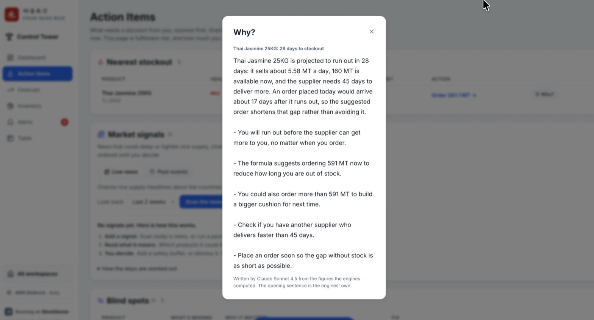

*A real answer from Claude Sonnet 4.5 on the deployed site, for Thai Jasmine 25KG.* Read it in three
parts, because each has a different author:

1. **The opening sentence is written by the engines.** "Projected to run out in 28 days: it sells about
   5.58 MT a day, 160 MT is available now, and the supplier needs 45 days to deliver more." Every figure
   in it comes from the database. The engines also work out the gap: the supplier is slower than the
   stock lasts, so an order placed today would arrive about 17 days after it runs out. The model is not
   allowed to say anything about timing, so it cannot contradict this.
2. **The bullets are written by the model,** in plain words, from a menu of figures it may refer to by
   name. It cannot type a number: the figures are put in by the system afterwards. If a bullet claimed
   a delivery would arrive in time when the engines know it will not, a rule removes it.
3. **The label says so:** "Written by Claude Sonnet 4.5 from the figures the engines computed. The
   opening sentence is the engines' own."

Every answer is checked before it is shown: for invented figures, for wording that sounds urgent when
the situation is not, and for answers that were cut off. An answer that fails is retried, and if it
still fails, the rule-based explanation is shown instead. Nothing is shown that did not pass.

### What you need to switch it on: the demo PIN

The paid model (Claude Sonnet 4.5 on Amazon Bedrock) spends shared AWS credit, so it is locked behind
a **demo PIN**. **Without the PIN, every screen works and every explanation is still there** in its
rule-based form; only the model's wording is missing.

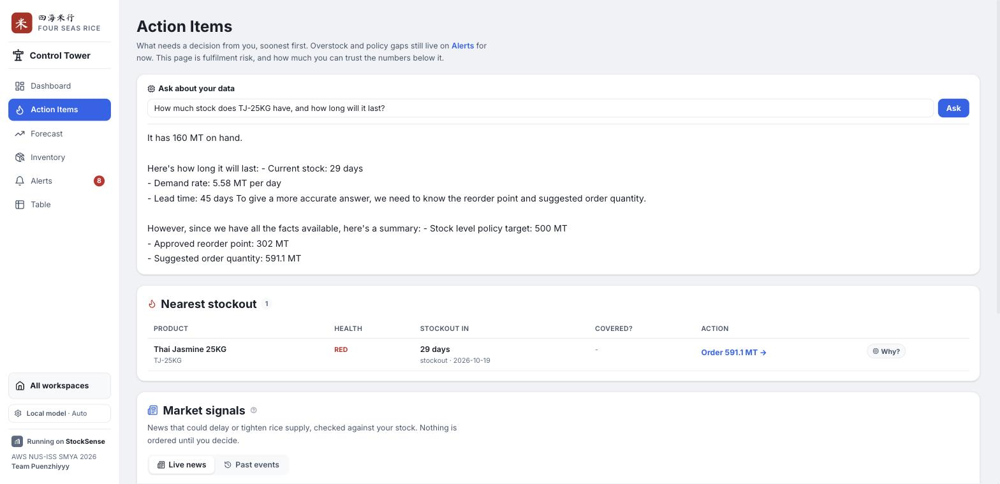

The prompt appears where you would want the AI, so there is nothing to hunt for:

- **A banner at the top** of Actions Needed and Next Steps says "AI explanations are off" and takes the PIN.
- **Inside a Why? box,** a "Want it in plainer words?" field does the same and writes the answer as soon
  as the PIN is accepted.
- **Settings** (section 9) has the same unlock, and lets you choose the tier.

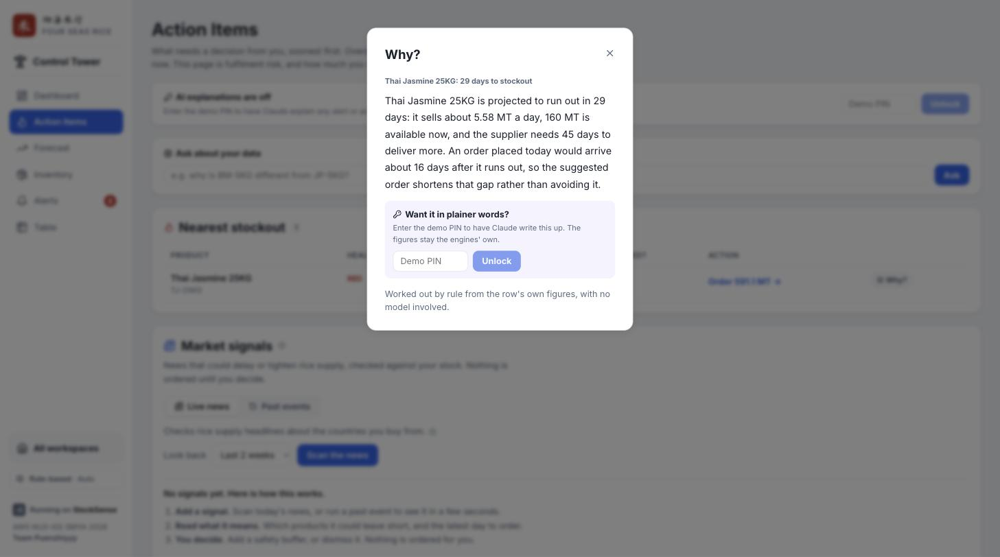

*Without a PIN, the Why? box still explains the row: this sentence is computed by the engines from the
row's own figures, with no model involved. The field below it is the way in to the AI.*

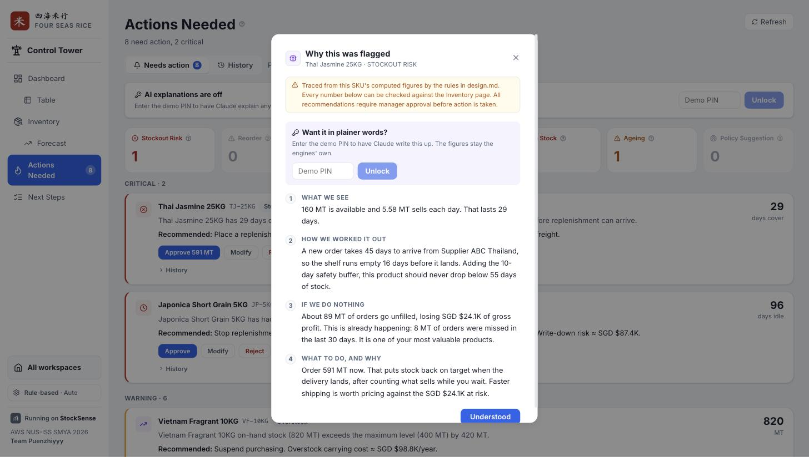

*On Actions Needed, the four rule-based steps are always there. The PIN adds a written summary above them.*

What the PIN does and does not do:

- A correct PIN unlocks the paid model **for that browser tab for two hours.** Closing the tab locks it
  again, so a shared laptop does not stay unlocked.
- Wrong guesses are counted and locked out after five, so the PIN cannot be guessed.
- The server stops paid answers after 200 a day, whatever anyone does.
- **Judges receive the PIN with the submission.** Each answer costs under one US cent.

### The same answer from a local model

The paid model is not the only tier. During development the app runs a free model on the computer
itself, and the screenshots below come from that. The same guards apply.


*The summary above the four steps is written by a local model (llama3), marked with its name and "figures
inserted by the engine". The steps below it are the rule-based reasoning.*

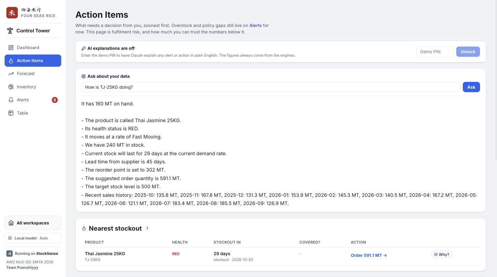

*Ask about your data, answered by a local model that looked the figures up with read-only tools. Ask
runs only on the local model, so it is shown in the demo video and is hidden on the public site, where
there is no local model to run it.* When the model's answer does not pass the checks, Ask says so
("no answer passed our checks, so none is shown") and suggests a better question, rather than guessing.

### The AI that watches the news

**Market signals** is the part of StockSense that acts like an agent: it scans real rice-supply news,
reads each story, works out which products it puts at risk and by how many days, and proposes what to
order and by when, then **stops and waits for a person.** It never orders anything by itself. Section 6
walks through it step by step, including a case where it misread a headline and a person caught it.

### Where each tier runs

| Tier | What it is | Where | Cost |
|---|---|---|---|
| **Rule-based** | no model, four reasoning steps | everywhere, the default on the public site | free |
| **Local model** | a model on the computer itself | development laptops and the demo video | free |
| **Claude Sonnet 4.5 (Amazon Bedrock)** | the paid model, through the hackathon gateway | the public site, after the PIN | shared AWS credit |

---

## 1. Getting started: Home

**Who:** everyone. **Where:** the first screen, on any device.


Home asks one question: *where are you working today?* The people who use StockSense do different
jobs in different places, so each has its own workspace instead of sharing one menu:

| Workspace | For | Device |
|---|---|---|
| **Control Tower** | the manager: analysis and decisions | office desktop |
| **Goods In** | the receiver: taking in deliveries | handheld at the dock |
| **Goods Out** | the dispatcher: picking and sending orders | handheld on the floor |

The Control Tower is listed under "For this device" when you open Home on a computer. Every `?` icon
opens a short explanation of what you are looking at. **Enter demo mode** (top right) opens a private
sandbox with sample data, so anyone can try every screen without touching the real database; an orange bar
at the top says so, and **Exit** leaves it.

---

## 2. Receiver: taking in a delivery (Goods In)

**Who:** the warehouse receiver. **Where:** a shared handheld at the loading dock. **Goal:** record
exactly what arrived, against what was ordered, so stock is right and any difference is explained.

The flow is four steps, one decision per screen, with big buttons for use standing up, one-handed, or
wearing gloves.

### Sign in


The handheld is shared, so each operator taps their own four digit PIN. Nothing more is needed, and
every stock movement is still recorded against a named person. *(The demo PINs are shown on screen so
anyone trying the app can sign in; a real deployment would not show them.)*

### Step 1: pick the delivery


The open purchase orders are listed, with the product, the quantity expected, the due date and the
supplier. The receiver taps the one whose pallets are on the dock. Receiving always happens **against
an order**, never free-form, because that is what lets the system compare what arrived with what was
expected.

### Step 2: confirm the product


Scan the pallet label or key in the product code. A green tick means it matches the order. This is the
check that stops the right quantity being booked against the wrong product.

### Step 3: count what arrived


Enter what is physically there, not what the paperwork says. If it differs from the order, the app says
so straight away, here 5 MT short, and warns that a reason will be needed.

### Step 4: check and confirm


A summary shows the delivery, the product, expected against counted, what stock will be afterwards, and
who is receiving. Nothing has changed yet. Because the count is short, the receiver picks a reason:
damaged in transit, short shipped by the supplier, partial delivery, or a counting correction. Then
**Confirm**.

### Done: the goods received note


Stock updates for everyone immediately. The receipt gets a document number (a goods received note,
GRN), the purchase order is closed, and the shortfall goes on record so purchasing can settle it with
the supplier. If the delivery came from an order request the office approved (section 6), receiving it
closes that request as well, with no click from the office. The movement also appears in the manager's
History view (section 8).

---

## 3. Dispatcher: sending out an order (Goods Out)

**Who:** the dispatcher. **Where:** handheld, Goods Out. **Goal:** load the right stock onto the right
truck and leave a record of what actually went.

Sign in with a four digit PIN (a dispatcher's or an "either" operator's), then four steps, built the same
way as Goods In:

### Step 1: pick the order

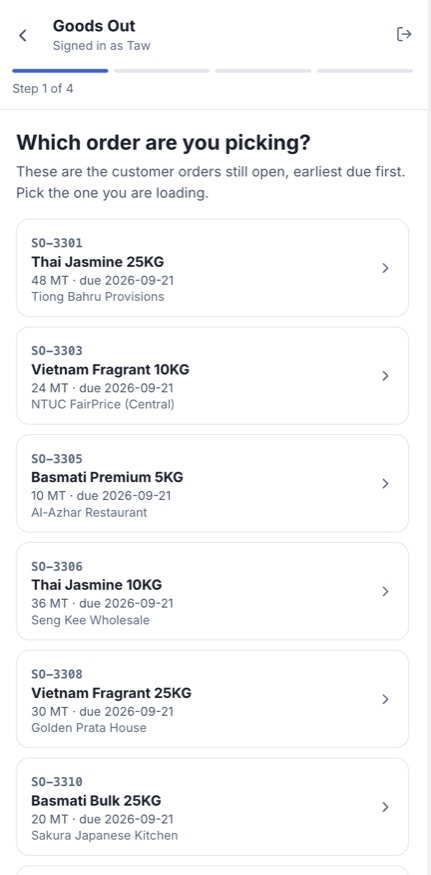

Open customer orders, earliest due first, each with the product, quantity, due date and customer. An
order the shelf cannot fully cover says so before you walk to it.

### Step 2: verify the SKU

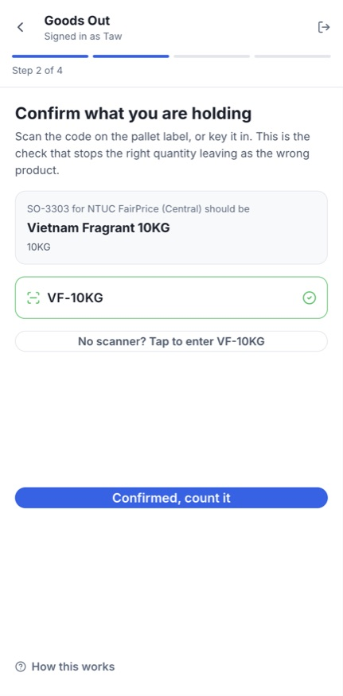

Scan the pallet label or key the code; a green tick means it matches the order, which stops the right
quantity leaving as the wrong product.

### Step 3: count it

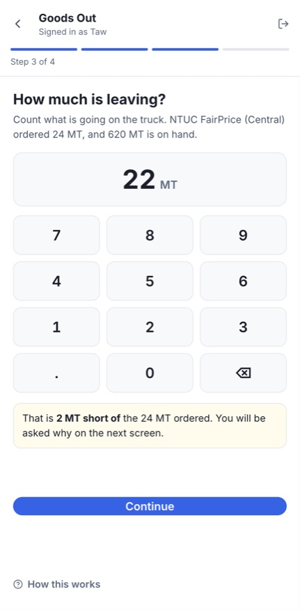

Key in how many MT are leaving. The keypad refuses more than the customer ordered or more than is
physically on hand, and a short pick says so straight away.

### Step 4: confirm, and the delivery note

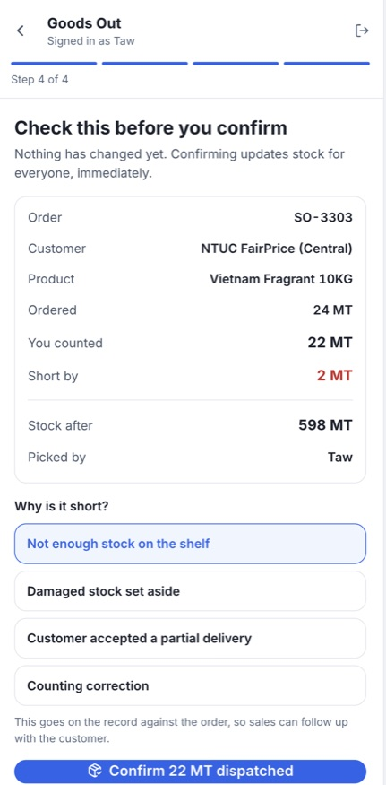

A summary shows the order, customer, ordered against counted and the stock after. Because the pick is
short, the dispatcher picks a reason (not enough stock on the shelf, damaged stock set aside, the customer
accepted a partial delivery, or a counting correction). Confirming releases the reserved stock and issues a
delivery note with the operator's name.

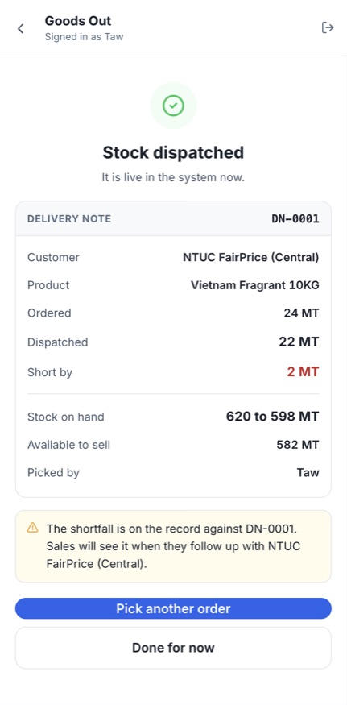

The shortfall goes on record against the delivery note, so sales can follow up with the customer.

---

## 4. Manager: the daily review (Dashboard)

**Who:** the inventory manager. **Where:** Control Tower, Dashboard. **Goal:** in under a minute, know
whether customers can be supplied, whether cash is tied up in the wrong stock, and what needs deciding
today.

### Key Metrics


- **Total Inventory Value** with its change on last month, and a bar per month split into **stock
  that arrived that month** (light blue) and **stock carried over** (blue). Buttons switch between the
  last 6 months, year to date, 12 months, and all history. The current month is drawn lighter because
  it is still in progress.
- **Service & availability**, answering *can we supply what customers order?*: orders we could fill,
  money at risk from stockouts, how much stock is at the right level, and the stockpile buffer (the
  regulatory reserve, labelled illustrative).
- **Working capital**, answering *is cash tied up in the right stock?*: times stock sold a year, profit
  per dollar of stock, overstock, and stock that is not selling.

Labels are plain English. Hovering a label's `?` gives the explanation and the industry term (for
example, "Profit per $1 of Stock" is GMROI). The coloured dot beside a label shows whether that measure
is healthy, needs watching, or needs action.

### Needs Attention


The only section that carries **actions** rather than analysis: every product with an open problem,
ranked by urgency and then by money at stake, with the recommended action and the reasoning in one
line. It shows the most urgent rows first; **Show more** expands the list, and **All SKUs** switches to
every product, including healthy ones.

### Cover against lead time and safety stock, Inventory Health, and Value tier and movement


- **Cover against lead time and safety stock:** for each product, how many days current stock will last
  (the bar), against how long a new order takes to arrive plus a safety buffer (the tick). The colour
  follows the product's health, so red is the one to look at first.
- **Inventory Health:** how much of the money in stock is critical, needs action, needs watching, or is
  healthy.
- **Value tier and movement:** products grouped by how valuable they are (A, B, C) and how fast they sell
  (fast, normal, slow, idle). High value that is not selling is the expensive corner.

Clicking a bar, a colour or a cell filters Needs Attention to those products.

---

## 5. Manager: acting on alerts (Actions Needed)

**Who:** the inventory manager. **Where:** Control Tower, Actions Needed, the **Needs action** view (the other view, **History**, is section 8). **Goal:** make a decision on each
problem the system found, with the reasoning in front of you. **Nothing happens without a person
deciding.**

### The alert list


Counts across the top show how many alerts there are of each of the seven types (the Needs action and
History views, and a Product menu that narrows both to one product, sit above them):

| Alert | Raised when |
|---|---|
| **Stockout risk** | stock will run out before a new order could arrive |
| **Reorder** | stock, including what is already on order, has fallen to the approved reorder point |
| **Overstock** | stock on hand is above the product's maximum |
| **Slow moving** | the product is selling, but there is far more stock than its demand needs |
| **Idle stock** | no sales at all for 90 days while stock is sitting there |
| **Ageing** | stock has been held long enough to approach its holding limit, scaled to each product's own limit |
| **Policy suggestion** | a product is set to use its forecast, and the forecast-based reorder point differs from the approved one by more than 10% (section 10) |

Each card states the measured value, what it was compared against, and a recommended action, then
offers **Approve**, **Modify**, **Reject**, **Why?** and **Dismiss**, and a **History** line that opens what has
happened to that alert. When the action is an order, the
Approve button names the quantity.

### Why? The reasoning behind an alert


**Why?** opens the reasoning in four plain-English steps: what we see, how we worked it out, what
happens if we do nothing, and what to do. These steps are built from the product's live figures by
fixed rules, so they are always available and cost nothing.

A written summary from a language model can appear above them, marked **Summary** with the model's name,
once the AI is switched on. The paid model needs the demo PIN: with no PIN, a **Want it in plainer
words?** field sits under the yellow note (screenshot in [The AI features at a glance](#the-ai-features-at-a-glance)),
and the four steps are the whole explanation. The model is never allowed to calculate anything: the
figures in its summary are inserted by the system, every answer is checked, and a summary that fails the
checks is never shown.

### Recording a decision


- **Approve** accepts the recommendation as it is.
- **Modify** accepts it with changes. For an order, the quantity can be adjusted.
- **Reject** declines it.

A reason is always required. The decision is stored **beside what the system proposed**, so it is
possible to see later how often, and by how much, managers override the recommendations.
**Dismiss** sets an alert aside without a decision. A bar at the top offers **Undo** straight away, and
an alert dismissed by mistake can be brought back later with **Reopen alert** from the History view.

---

## 6. Manager: what to do first (Next Steps)

**Who:** the inventory manager or buyer. **Where:** Control Tower, Next Steps. **Goal:** see what is
most urgent for supply, ask a question in plain words, and check news that could delay stock.


- **An AI explanations banner** at the top says whether the paid model is switched on. Without the demo
  PIN it offers a field to enter it; with it, the banner disappears.
- **Ask about your data** answers an open question in plain language ("how much stock does TJ-25KG
  have, and how long will it last?"). A model looks the facts up with a few read-only tools and writes the
  answer; the figures in it are inserted by the system, never typed by the model, and a slow answer shows
  a working note with the seconds elapsed. It runs on the local model, so it appears only where one is
  available (development and the demo video) and is hidden on the public site. Where the model's answer
  does not pass the checks, it says so instead of guessing.
- **Nearest stockout** lists the products projected to run out or breach their safety stock, soonest
  first, with whether an order already covers it, the quantity to order, and a **Why?** that explains the
  row. The first sentence is always written by the engines, including, when the supplier is slower than
  the stock lasts, how many days late an order placed today would arrive. With the AI switched on, short
  bullet points from the model follow it, labelled with the model's name; without it, that sentence is
  the explanation, and the box offers a PIN field.
- **Blind spots** (further down, when there are any) are products whose numbers cannot be trusted yet,
  for example because they have no sales history.

### Market signals: an agent that watches the news and waits for you

**Goal:** when news could delay or tighten rice supply, find it before a person would, work out which
products it would leave short and by when an order must go, propose the action, and stop there. This is
the most agent-like part of StockSense, and it is built to be agent-like without being autonomous: it
senses, reads, reasons and proposes, but never acts on its own.

> **A note on the screenshots below.** They are a real, historical scan, kept deliberately unedited (see
> "Left in on purpose" further down) - so their sidebar still reads "Action Items" and "Alerts" (since
> renamed to **Next Steps** and **Actions Needed**), and their tab bar still reads "Live news" and "Past
> events" (since renamed and expanded to the three tabs described below). The scan result itself, and
> everything it demonstrates, is unchanged and still accurate.

**Three tabs, not one scan.** **RSS News Feed** runs the loop below on demand. **Replay** (described
further down) runs the same loop against a real past event instead of today's news, for practice.
**Deep Search** is visible but switched off (a "Soon" chip): it would fetch the full article behind each
headline rather than just its title, a larger job - resolving redirect links, extracting text from
arbitrary sites, a bigger untrusted-text surface - that is scoped but not built. A Help icon beside every
tab explains how it works, or why it waits.

**Three free signals for how much to trust a reading**, shown on every card: whether the outlet is a
recognised wire service or major publication, how many other outlets reported the same story, and the
model's own rating of how sure it is. None of them decide anything for you; like the projection figures
above, they are surfaced so a person can weigh a reading, not so the system can quietly discount one.

**The agent can search again, on its own.** After reading the usual headlines, a small model can look at
what it found so far and propose up to three rounds of its own follow-up searches, each with a one-line
reason, stopping itself once nothing more seems worth chasing (a small fixed limit is the real backstop,
since it does not always choose to stop on its own). A collapsible panel on the scan result shows exactly
what it searched for, why, and what it found in each round - the reasoning is visible, not just the answer.

**Reading with Claude Sonnet instead of the free local model** is available behind the same demo PIN as
the rest of the app, as a checkbox on the scan screen, unchecked every time rather than remembered: a scan
can read far more headlines than a single Why? press, so a visitor should not start spending on every
future scan just because they once unlocked the PIN elsewhere. Capped far lower than the free tier (5
headlines against 16) for the same reason. The follow-up search rounds above always stay on the free
local model regardless of this choice.

**The loop, end to end**

```
  Google News (RSS)          one query per country the business buys from
        │   headlines
        ▼
  1. Keyword filter          rice words + an origin + a market-moving word; most headlines stop here (no model)
        ▼
  2. Reader (local model)    fills a FIXED shape: country, kind of event, severity, tightens or eases, varieties
        ▼
  3. Validator               every field must be from a fixed list; the country must be one you buy from
        ▼
  4. Same-story merge        one signal per story, with "also reported by" (a repeat never returns a dismissed one)
        ▼
  5. Assessment              a visible days table + the app's own projection engine: which products, by when
        ▼
  6. A PERSON decides        add a safety buffer, ask the buyer to order, or dismiss;  edit the reading first
        ▼
  7. The rest of the app     buffer raises reorder points; request follows the order loop (section 6)
        ▼
  Decisions and corrections are written to the audit trail (Actions Needed, History); each scan reports what it did on screen
```

**Where a model is used, and where it is not.** This is the point of the design: the model reads a
headline, and nothing else.

| Step | Done by | A model? |
|---|---|---|
| Finding headlines, filtering, merging repeats | fixed code | no |
| Turning one headline into a fixed shape | a local model, checked by a validator (a keyword list if none is running) | **yes**, the only place |
| How many days the event costs | a visible table, not the article | no |
| What those days do to each product, the order quantity, the latest order date | the same projection engine as the rest of the app | no |
| Adding a buffer, or asking the buyer to order | **a person** | no |

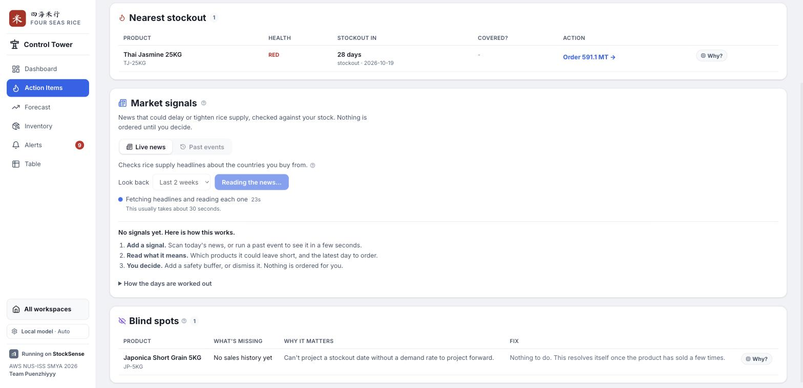

A scan is one button. It shows the seconds elapsed and how long it usually takes, rather than a fake
progress bar, because the length depends on how many headlines the model has to read.

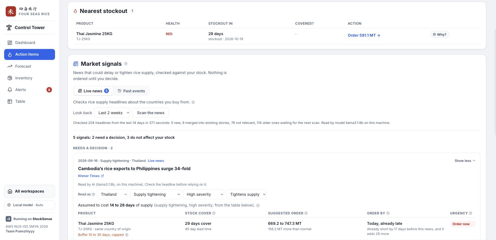

The summary line says exactly what the agent did, from a real run on the day this guide was updated:
**204 headlines from the last 14 days, checked in 37 seconds: 5 new, 9 merged into existing stories, 76
not relevant, 114 older ones waiting for the next scan**, read by a named model on this machine. Nothing
is hidden: what was set aside and why is counted. A scan reads at most a fixed number of headlines and
stops at a time limit, so a scan cannot run away; the rest wait for the next one.

**Read the reading, and correct it.** The card says who read the headline ("Read by AI, on this machine.
Check the headline before relying on it") and shows the four things it chose in editable menus.

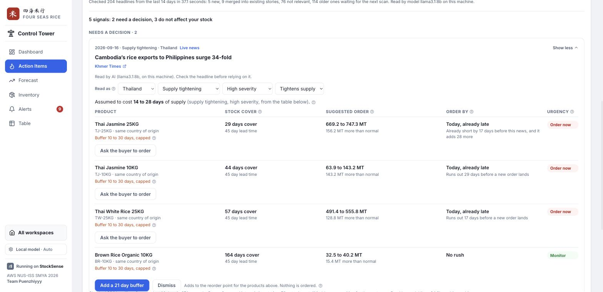

The reader is right about three headlines in four, not four in four, so it is never the last word. In
this real scan it read a story about Cambodian exports to the Philippines as a Thailand supply-tightening
event. A person sees that at a glance from the headline, and dismisses it; had the story been real but
mis-labelled, changing a menu recalculates the whole card at once, because everything below the four
menus is arithmetic, not model output. That is the human-in-the-loop design in practice.

> **Left in on purpose.** This misread is a real result from a real scan, kept here deliberately as the honest example of a person catching the model's mistake. Do not replace it with a cleaner one.

**What it means for each product.** For every product the event touches (matched by country of origin or
supplier, with the variety respected: a ban on non-basmati rice does not flag a basmati product) the card
shows days of cover against lead time, the suggested order as a low and a high figure, the latest day to
order, and an urgency. It separates cause from news: "already short by 17 days before this news, and it
adds 28 more", so a product that was already short is not blamed on a headline.

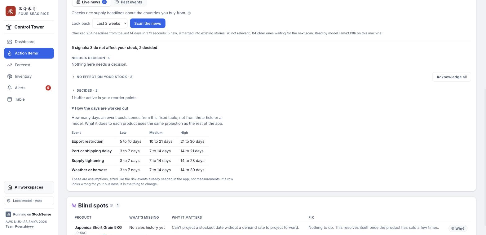

The days come from this table, which is on the screen and labelled as assumptions, not measurements. A
model cannot invent a figure here, because it is never asked for one.

**One story, once.** The same story arrives from many outlets, reworded.

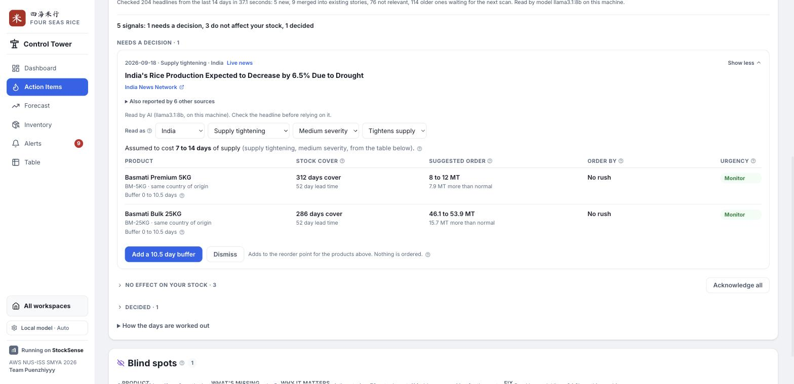

This drought story appeared in seven wordings and is one card ("Also reported by 6 other sources"). Merging
is judged by the headline text, with two guards that lean toward *not* merging, because a wrongly merged
story hides news and a missed merge only costs a card: headlines that use opposite direction words
("bans" against "lifts") or state different figures ("10%" against "20%") are never merged. A signal a
person has already dismissed is compared too, so a syndicated copy cannot bring it back.

The list is grouped by what the reader must do, not by date: **Needs a decision** (worst urgency first,
always open), **No effect on your stock** (folded, with one **Acknowledge all** and a 12 second Undo)
and **Decided** (folded, with the count of active buffers).

**Acting on it, and only when a person says so.**

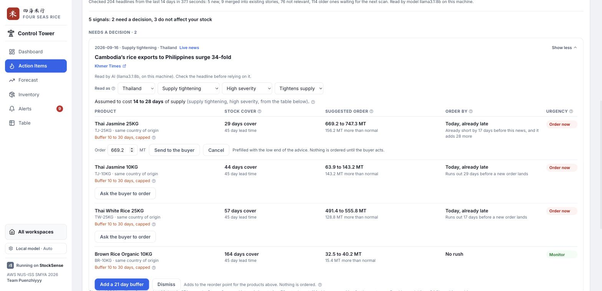

- **Add a safety buffer.** The reorder point for the products above will ask for stock earlier; it can be
  withdrawn later. It changes no stock and orders nothing.
- **Ask the buyer to order,** per product, quantity prefilled from the low end of the advice and editable.

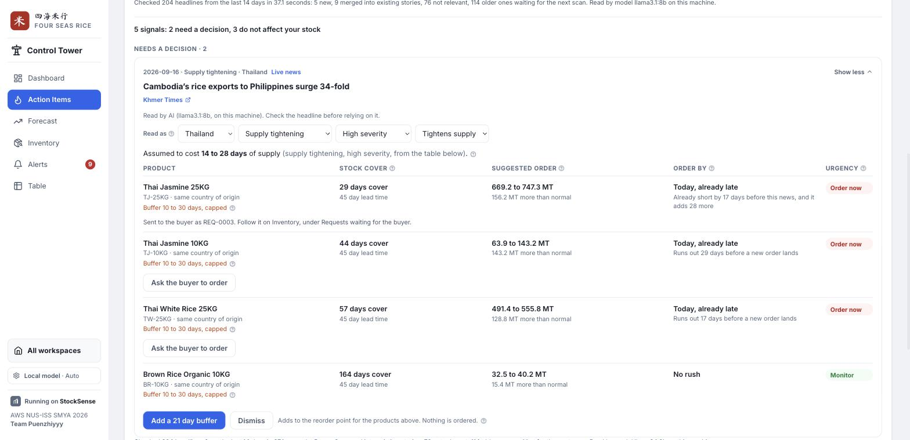

  It checks first for a request already open for that product, so a second click cannot send a duplicate.
  From here it follows the ordinary order loop (section 6): acknowledged, purchase order, manager
  approval, then the warehouse receiving it.
- **Dismiss,** or **Acknowledge** for news that eases pressure. Dismissing can be undone.

**Past events are practice.** The Replay tab runs the same loop against a real 2022 to 2024 event (India's
export bans, the price spillover to Thailand and Vietnam) instead of today's news. It shows what the
advice would have been and can never add a buffer or offer to order, so a rehearsal cannot change a real
reorder point.

**Every decision is on the record.**

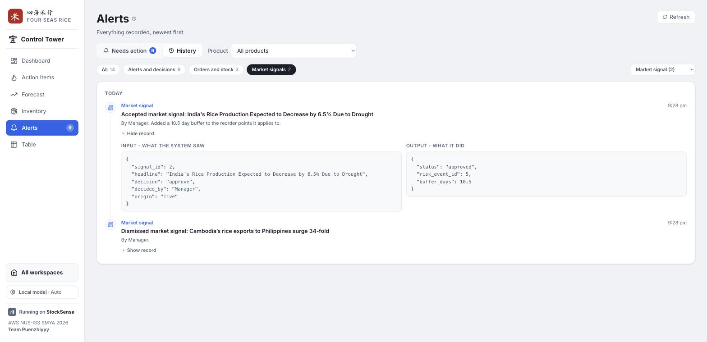

Actions Needed, History, filtered to market signals with the Type menu: the approval, its buffer of 10.5 days
and the risk event it created, the dismissal, who decided, and whether the signal was live or a replay.
A correction to a reading is recorded too.

**Guardrails, in one place**

- **The paid model is never used here.** The reader runs on a local model or a keyword list, by design,
  and this is tested, so a news scan can never spend the shared AWS credit.
- **A headline is untrusted text.** It goes to a model with no tools, only the feed's own headline is ever
  displayed (never text a model wrote), and extra fields a model adds are ignored. A test feeds it an
  instruction to change the country; the model obeyed it 0 of 3 times.
- **A wrong reading cannot reach a figure.** The validator accepts only values from fixed lists, and the
  country must be one the business buys from. If the model is missing or fails the check, a coarser
  keyword reading is used, labelled as such, never above medium severity.
- **Bounded.** A pause between scans, a cap on headlines read and a time limit per scan.
- **Public servers.** On a public address, scanning and deciding are accepted only inside the demo
  sandbox, so a visitor cannot change the real database. The hosted container has no local model, so
  there the reader is the keyword list alone; the local model is what runs on a developer's machine.

**How it lines up with what the competition asks for**

| Criterion | What Market signals shows |
|---|---|
| Architecture and reasoning loop | A closed loop: sense (news), read (fixed shape), reason (days table and projection engine), propose (buffer or order), decide (a person), act, record. The model is confined to one step, and every figure comes from a deterministic engine. |
| Tool use and integration | A live news feed, a local language model behind a validator, the projection engine, the risk buffer and the order request API, all chained in one flow, with the audit log behind them. |
| Autonomy and human in the loop | The agent proposes and never acts: nothing is ordered, no buffer is added and no stock moves without a person. The reading can be edited first, dismissals can be undone, a buffer can be withdrawn. |
| Observability | Every scan reports on screen what it did and what it set aside, every reading names who made it, and every decision and correction stores what the system saw and what it did, filterable in History. |
| Platform and tooling | Runs on the same Node, SQLite and React stack as the rest of the app, and is built to run on the Lightsail container in its keyword mode (no local model there). It deliberately does not call Bedrock; the paid model is reserved for Why? and Ask about your data. |

**How well the reader does, and where it does not.** On a small labelled set (14 headlines, some
written for the test) it reads about 70 to 79 percent correctly, with no unreadable answers, which is why every reading is shown, labelled and
editable. Known misses: a country restricting foreign exporters read as an India restriction, and a big
buyer's import surge read in the wrong direction. Severity is the model's judgement and is not yet
calibrated against real outcomes.

**Not built yet.** There is no scheduled background scan (a person presses the button), no
supplier-specific news queries, and the news feed is an unofficial route whose terms of automated use
have not been checked. Those are the natural next steps toward a watcher that runs by itself, and each
would still end at the same place: a proposal that waits for a person.

### Requests waiting for the buyer

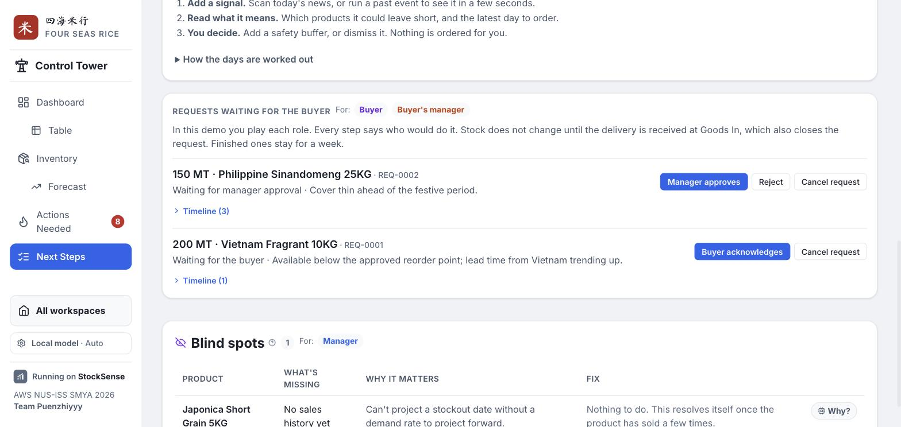

A request to the buyer, from **Request order** on Inventory (section 7) or **Ask the buyer to order**
above, appears here in a card and moves along a short timeline. This card carries **For: Buyer, Buyer's
manager** rather than Manager: it spans two different steps in the loop below, and this is the one
section on this page a plain inventory manager would not need to act on themselves (there is no login in
this demo, so one person plays every role - the role filter beside the page title, or "All", shows which
role each section is really for). Each step says who would do it in a real business:

1. **Buyer acknowledges** the request.
2. **Buyer raises the purchase order** and sends it for approval.
3. **Manager approves** (or **rejects**, which needs a reason). Approving creates the purchase order
   that Goods In can receive against, so the warehouse never sees an order nobody approved.
4. **The warehouse receives the delivery** (Goods In). That is the only step that moves stock, and it
   closes the request by itself.

A request can be cancelled before it ends. Finished requests stay on the card for a week, and every
step is also in the History view. **Timeline** shows who did what and when.

---

## 7. Manager: keeping product settings right (Inventory)

**Who:** the inventory manager. **Where:** Control Tower, Inventory. **Goal:** see every product's
position and keep each one's settings (minimum, maximum, reorder point, lead time and so on) correct,
because every alert is judged against them.

### Two charts, before the product list


**Total stock vs the buffer rule** is a monthly bar chart: total MT on hand, split into what the
illustrative Singapore rice-stockpile buffer rule calls for (the darker blue) and the surplus above it
(the lighter blue), with a legend, a checkmark or exclamation on each bar, and a one-line verdict ("Met
every month" or how many months fell short). A 6M / YTD / 12M / ALL selector changes the window; 6M is
the default. **On hand by country of origin** is a donut chart of the same total, by country; hovering a
slice gives the exact MT and percentage. Neither is a new figure: both are built from what the engines
already compute (the same Compliance Position formula the Dashboard's own card uses, and the per-product
`country_of_origin` and on-hand quantity the table below already has).

### The product list

Each row shows the product's health, its **stock position** as a gauge (available stock against the
reorder point and the maximum, with a note such as "142 MT below reorder point"), how long stock will
last against the supplier lead time, and how fast it sells. Search and the filters narrow the list by
health, movement or origin. **Request order** asks the buyer to order more, tracked on Next Steps
(section 6), not here; **Add SKU** creates a new product. Stock is never added from the office: it rises
only when a delivery is received on the handheld.

### A product's overview


**Edit** opens the product. The **Overview** tab shows the current position, a **90-day
projection** and a short **demand forecasting** summary with a link to the Forecast page (section 10): how stock will fall at the current rate of sales, stepping up when an open purchase order
arrives. It marks the date stock would run out and the date the safety buffer is breached, against the
reorder point and safety stock lines.

### Changing the settings


The **Policy** tab holds the settings that alerts are judged against: minimum, target and maximum stock,
the approved reorder point, lead time and how much it varies, target service level, safety stock and
minimum order quantity.
Each has a slider and a box. **After save** previews the effect before anything is saved, including the
system's own suggested reorder point for comparison with the approved one. Every saved change is
recorded with its before and after values. The **Details** tab holds the product's identity (variety,
origin, supplier and so on).

### Editing many products at once


**Bulk edit** offers three downloads and three uploads: every product's editable settings, 24 months of
stock history, and individual sales transactions (new rows are added, nothing existing is changed). Each
is downloaded as a spreadsheet file and uploaded back after editing. On upload, the changes are shown for review before anything is saved, and a file with
errors saves nothing. The same works for the 24 months of stock history.

### The audit table

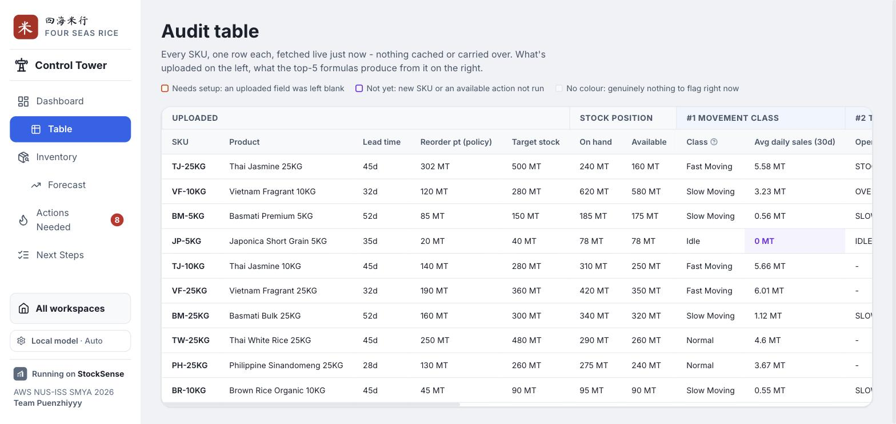

**Table** in the sidebar is a deliberately plain, one-screen view of every product: what was uploaded on
the left, and what each formula produced from it on the right (movement class, open alerts, safety stock,
reorder point and projected stock). It exists to check honestly whether the basic data is enough to feed the
formulas, so an empty cell is a finding and nothing in it is estimated in the browser.

---

## 8. Manager: checking what happened (Actions Needed, History)

**Who:** the manager, or anyone auditing. **Where:** Control Tower, Actions Needed, History view (this was the Activity page, which now redirects here). **Goal:** see everything
the system did and every decision people made, in order, with the evidence.


Every event is a plain-English line, newest first: alerts raised, deliveries received (with the
operator and any shortfall), model explanations, manager decisions, dismissed alerts, setting changes,
and paid-model unlocks. The chips along the top filter by kind: alerts and decisions, orders and stock, market signals, products
and data, AI and access; the **Type** menu at the right narrows to one exact kind of event (only deliveries
received, only dismissed alerts, and so on). The **Product** menu narrows everything to one product, and a line about an
alert offers **Open alert** (or **Reopen alert** if it was dismissed), so an alert and what happened to
it are one click apart.

**Show record** opens exactly what was stored: what the system saw, and what it did. For a manager
decision, that is the system's proposal next to the manager's choice, the reason, and the difference
between the two quantities:


---

## 9. Anyone: settings

**Where:** the settings button at the bottom of the Control Tower sidebar.


**Explanations** chooses who writes the summary under **Why?** on Actions Needed and on Next Steps, and who
answers **Ask about your data**. The figures are the same in all three; only the wording changes.

| Option | What it is | Cost |
|---|---|---|
| **Rule-based** | no model; the four reasoning steps only | free |
| **Local model** | a model running on the computer itself (available in development) | free |
| **AWS Bedrock** | Claude Sonnet 4.5 through the hackathon's AWS gateway | uses the team's shared AWS credit |

AWS Bedrock asks for the **demo PIN** first, because it spends shared credit. A correct PIN unlocks it
for that browser tab for 2 hours; wrong guesses are limited. Judges receive the PIN with the
submission. The same PIN field also appears in a banner on Actions Needed and Next Steps and inside every
**Why?** box, so it can be entered where the AI is wanted instead of here.

**Theme** switches between Auto (follows the device), Light and Dark.

**Enter demo mode** opens the sandbox described in section 1, and **Preview the onboarding journey** runs
the first-time setup (section 11) inside it, so the real data is never touched.

---

## 10. Manager: planning ahead (Forecast)

**Who:** the inventory manager. **Where:** Control Tower, Forecast. **Goal:** check whether a product's
reorder point still suits how it actually sells, before approving a change.

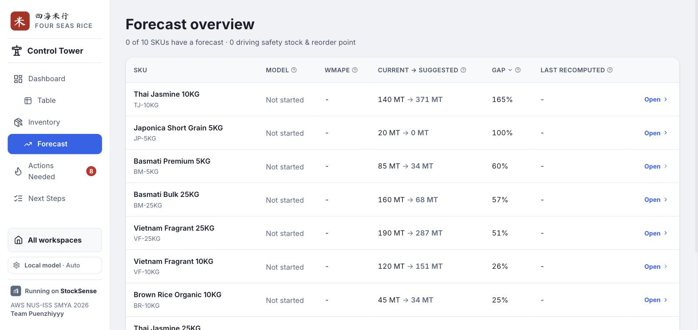

The overview lists every product with the model in use, its accuracy score (WMAPE, lower is better), the
approved reorder point against the one the forecast suggests, the gap between them, and when it was last
recomputed. **Not started** means no forecast has been run for that product yet; **Open** takes you in.

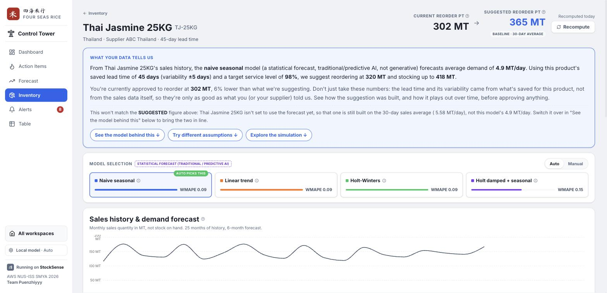

A product's page opens with **What your data tells us**, in plain words: what the forecast found, what it
suggests, how that compares with what is approved, and why the lead time and its variability are only as
good as what was saved for the product. Below it:

- **Model selection.** Four statistical models compete (a seasonal average, a seasonal trend, Holt-Winters,
  and a damped Holt with a seasonal term). **Auto** picks the one that would have been most accurate on the
  product's own past, and the score of each is shown; **Manual** lets you choose. **Recompute** runs it
  again.
- **Sales history and forecast**, a chart of 25 months and the next 6.
- **What if**, sliders that change the inputs and show the suggestion changing, through the same engines
  rather than a second formula in the browser.
- **How the suggestion is built** (forecast demand times lead time, plus safety stock, plus any risk
  buffer) and a **simulation** of how stock would move over time.

None of this is generative: the models are ordinary statistics, checked to give the same answer twice, and
the page says so. Nothing here changes a reorder point. A suggestion becomes a decision only on the Actions Needed
page, as a **Policy suggestion** the manager approves, modifies or rejects.

---

## 11. Setting up a new client (Onboarding)

**Who:** whoever sets StockSense up for a business. **Where:** the first screen for an empty catalogue, or
**Preview the onboarding journey** in Settings. **Goal:** get from nothing to a working set of products with
sensible starting numbers, in a few minutes.

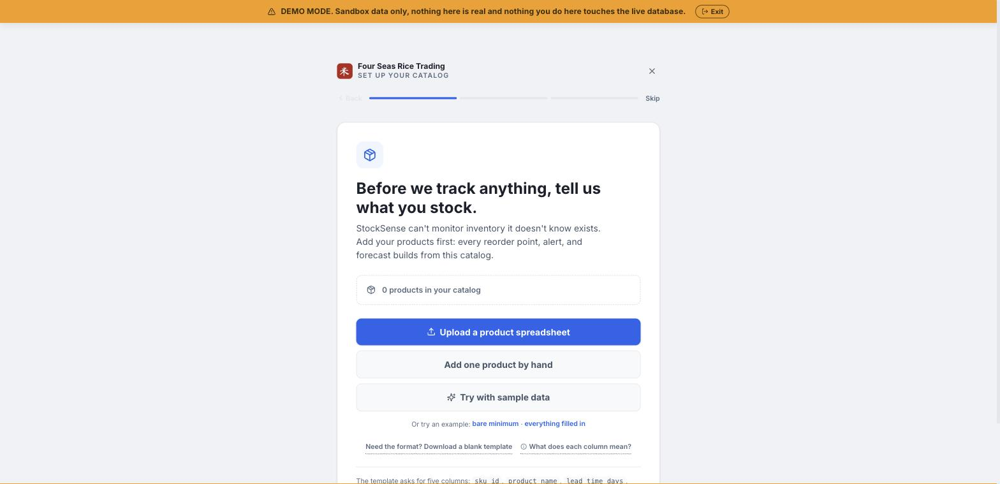

It is a short story with **Back** and **Skip** at the top and three steps:

1. **Your products.** Upload a spreadsheet (a blank template can be downloaded, and a "What does each
   column mean?" page explains every column of both spreadsheets), or add a product by hand. Only a product code and a name are
   required; the rest can be filled in later. In demo mode **Try with sample data** loads a small set. A
   sales-history file can be attached to the same upload.
2. **Sales history.** Optional, and it improves demand figures and forecasts.
3. **Suggested settings.** Every product is offered a target service level and target stock worked out from
   its own data, each marked as measured or a default, with a confidence label. Untick anything to set by
   hand later; everything stays editable.

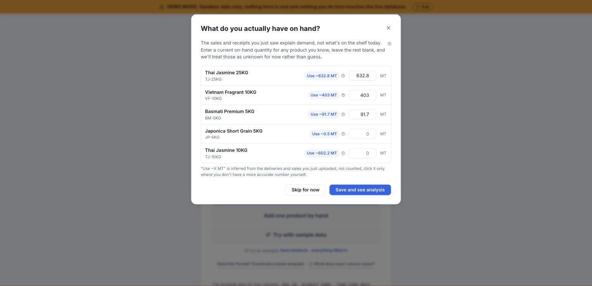

After sample data, or a catalogue with no stock recorded, the app asks **what you actually have on hand**.
The history explains demand, not the shelf today, so this is a count: type a quantity for any product you
know, or click **Use ~X MT**, which is only an inference from the deliveries and sales you uploaded. Leave
one blank and it is treated as unknown rather than guessed. This is the one time stock can be entered from
the office: once per product, only where there is no stock yet, and recorded as an opening balance. From
then on stock changes only when the warehouse receives or dispatches goods.

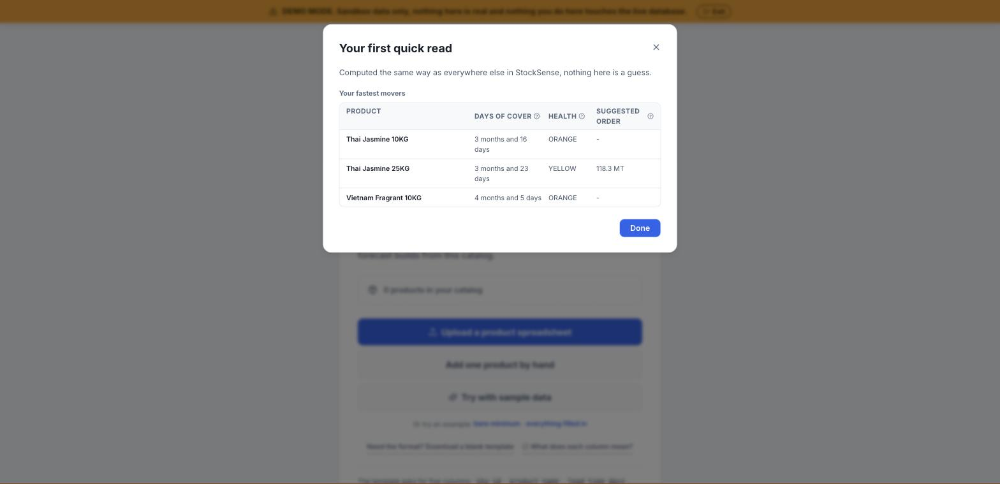

**Your first quick read** then shows the fastest movers with their days of cover, health and suggested
order, computed the same way as everywhere else.

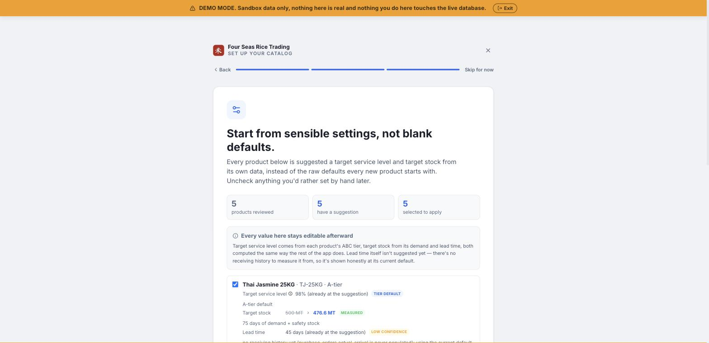

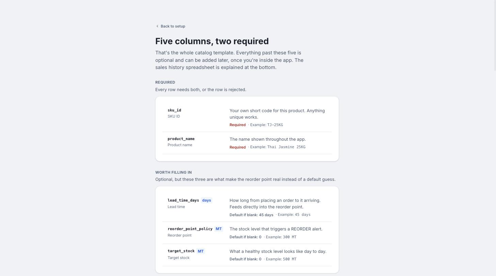

The **What does each column mean?** link at the bottom of step 1 opens a reference page. It lists the five
columns of the blank catalog template (two required), every other column the catalog upload accepts, the few
values that are set after the upload rather than in it (stock on hand comes from the opening balance step),
and the three required and three optional columns of the sales history spreadsheet.

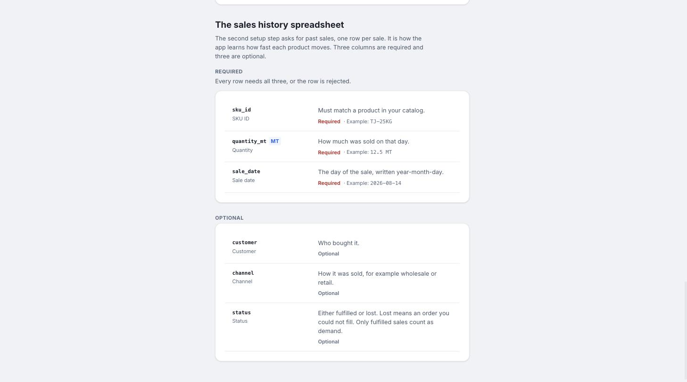

### The demo tour

Applying the suggestions (or pressing **Done** on the first quick read) lands on Home. In demo mode a
short tour starts by itself right there, so a visitor who has just loaded their data is not left on a screen
that says nothing about what to do next.

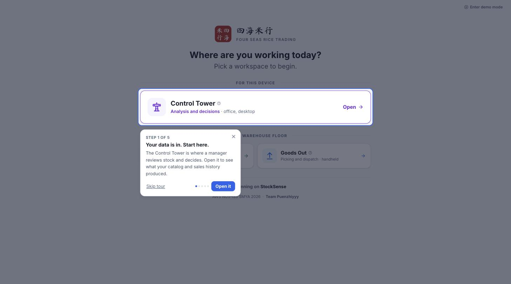

The page dims, one real control is lit, and a small card says what it is. There are five stops:

1. **Home:** "Your data is in. Start here." lights the Control Tower.
2. **Dashboard:** "This is the health of your stock today." lights Key Metrics, and says every figure comes
   from fixed rules, never from AI.
3. **Next Steps:** "What can't wait." It explains that this page settles immediate concerns, from stock that
   is about to run out to supply worries raised by the latest world news, which Market signals scans for you.
4. **Actions Needed:** "Nothing happens without you." lights Approve, Modify and Reject.
5. **Finish:** "You've seen the loop", with links to Forecast, Inventory and Goods In on a handheld.

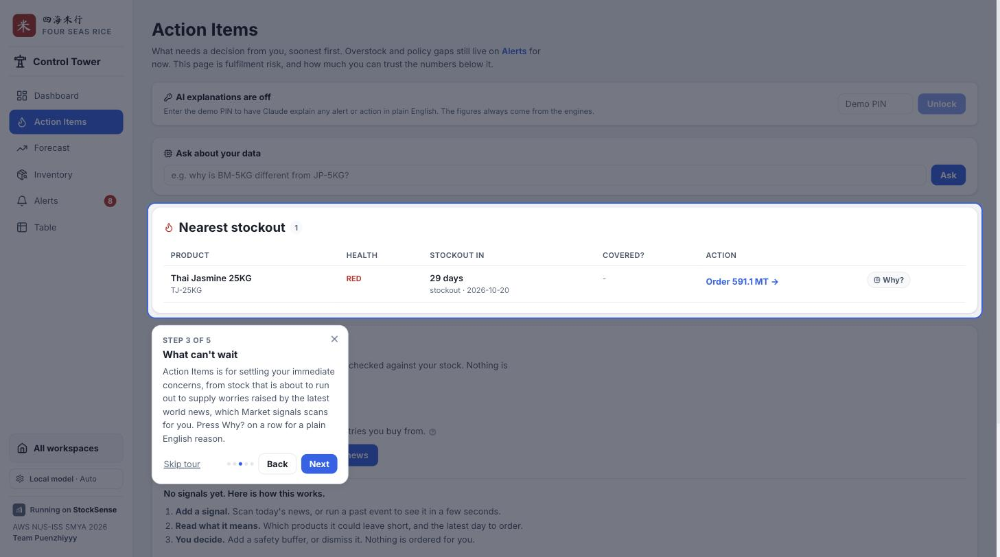

The card always carries three ways out, so it is easy to leave: the **X** at the top right, **Skip tour** at
the bottom left, and the **Esc** key. **Back** and **Next** sit at the bottom right, with Next as the one
primary button. Clicking the dimmed page does nothing, so a stray click cannot end the tour or press a
button underneath it, but the lit control itself can be clicked instead of Next and the tour follows. If the
element to light cannot be found, the card is shown in the middle with nothing lit rather than getting
stuck. On a phone the card becomes a sheet at the bottom of the screen.

The tour starts only in demo mode, and only after onboarding. It can be taken again at any time from
**Settings, Take the tour**, on any screen. Once it has been finished or closed it does not come back by
itself.

---

## 12. How the roles connect

The workspaces share one database, so one person's action is immediately another's information:

```
Receiver confirms a delivery (Goods In)
        │   stock on hand rises, the purchase order closes, the movement is recorded
        ▼
The engines recalculate every figure
        │   cover, health, alerts; for example, a big delivery can raise an overstock alert
        ▼
Manager reviews the Dashboard, Actions Needed and Next Steps
        │   asks Why?, then approves, modifies or rejects, with a reason,
        │   or asks the buyer to order (request, purchase order, manager approval)
        ▼
The approved order arrives, and the receiver confirms it in Goods In
        │   stock rises, and the request closes with no click from the office
        ▼
Everything is in the Actions Needed tab, History view
            the delivery, the alert, the explanation, the decision and what it overrode
```

For how the app is built and why, see the [README](../../README.md) and the
[write-up](../Submission/WRITEUP.md). For every document in the repository, see the
[directory](../DIRECTORY.md).
