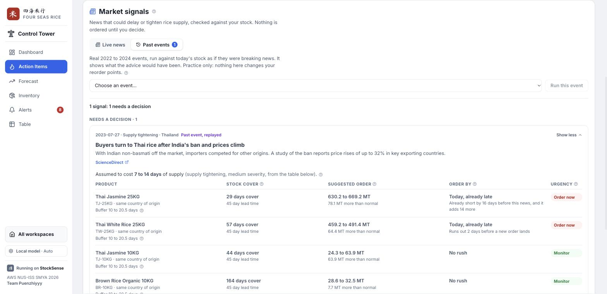

# StockSense features guide

What the app does, screen by screen, organised by **who uses it** and **what they are doing**. Written
for anyone meeting StockSense for the first time: judges, new teammates, and the people who will run
the warehouse.

> Screenshots come from the seeded demo data for the fictional client 四海米行 / Four Seas Rice
> Trading, captured on 20 Sep 2026, in light theme, against the seeded demo data. They are a snapshot: figures in them will differ from what the app
> shows on another day. How each figure is calculated is in
> [design.md](../../.kiro/specs/mvp1-inventory-visibility/design.md).

**Contents**

1. [Getting started: Home](#1-getting-started-home)
2. [Receiver: taking in a delivery (Goods In)](#2-receiver-taking-in-a-delivery-goods-in)
3. [Dispatcher: sending out an order (Goods Out)](#3-dispatcher-sending-out-an-order-goods-out)
4. [Manager: the daily review (Dashboard)](#4-manager-the-daily-review-dashboard)
5. [Manager: acting on alerts (Alerts)](#5-manager-acting-on-alerts-alerts)
6. [Manager: news that could hit your supply (Action Items)](#6-manager-news-that-could-hit-your-supply-action-items)
7. [Manager: keeping product settings right (Inventory)](#7-manager-keeping-product-settings-right-inventory)
8. [Manager: checking what happened (Alerts, History)](#8-manager-checking-what-happened-alerts-history)
9. [Anyone: settings](#9-anyone-settings)
10. [Manager: planning ahead (Forecast)](#10-manager-planning-ahead-forecast)
11. [Setting up a new client (Onboarding)](#11-setting-up-a-new-client-onboarding)
12. [How the roles connect](#12-how-the-roles-connect)

---

## 1. Getting started: Home

**Who:** everyone. **Where:** the first screen, on any device.


Home asks one question: *where are you working today?* The people who use StockSense do different
jobs in different places, so each has its own workspace instead of sharing one menu:

| Workspace | For | Device |
|---|---|---|
| **Control Tower** | the manager: analysis and decisions | office desktop |
| **Goods In** | the receiver: taking in deliveries | handheld at the dock |
| **Goods Out** | the dispatcher: picking and sending orders | handheld on the floor |

The Control Tower is listed under "For this device" when you open Home on a computer. Every `?` icon
opens a short explanation of what you are looking at. **Enter demo mode** (top right) opens a private
sandbox with sample data, so anyone can try every screen without touching the real database; an orange bar
at the top says so, and **Exit** leaves it.

---

## 2. Receiver: taking in a delivery (Goods In)

**Who:** the warehouse receiver. **Where:** a shared handheld at the loading dock. **Goal:** record
exactly what arrived, against what was ordered, so stock is right and any difference is explained.

The flow is four steps, one decision per screen, with big buttons for use standing up, one-handed, or
wearing gloves.

### Sign in


The handheld is shared, so each operator taps their own four digit PIN. Nothing more is needed, and
every stock movement is still recorded against a named person. *(The demo PINs are shown on screen so
anyone trying the app can sign in; a real deployment would not show them.)*

### Step 1: pick the delivery


The open purchase orders are listed, with the product, the quantity expected, the due date and the
supplier. The receiver taps the one whose pallets are on the dock. Receiving always happens **against
an order**, never free-form, because that is what lets the system compare what arrived with what was
expected.

### Step 2: confirm the product


Scan the pallet label or key in the product code. A green tick means it matches the order. This is the
check that stops the right quantity being booked against the wrong product.

### Step 3: count what arrived


Enter what is physically there, not what the paperwork says. If it differs from the order, the app says
so straight away, here 5 MT short, and warns that a reason will be needed.

### Step 4: check and confirm


A summary shows the delivery, the product, expected against counted, what stock will be afterwards, and
who is receiving. Nothing has changed yet. Because the count is short, the receiver picks a reason:
damaged in transit, short shipped by the supplier, partial delivery, or a counting correction. Then
**Confirm**.

### Done: the goods received note


Stock updates for everyone immediately. The receipt gets a document number (a goods received note,
GRN), the purchase order is closed, and the shortfall goes on record so purchasing can settle it with
the supplier. If the delivery came from an order request the office approved (section 7), receiving it
closes that request as well, with no click from the office. The movement also appears in the manager's
History view (section 8).

---

## 3. Dispatcher: sending out an order (Goods Out)

**Who:** the dispatcher. **Where:** handheld, Goods Out. **Goal:** load the right stock onto the right
truck and leave a record of what actually went.

Sign in with a four digit PIN (a dispatcher's or an "either" operator's), then four steps, built the same
way as Goods In:

### Step 1: pick the order


Open customer orders, earliest due first, each with the product, quantity, due date and customer. An
order the shelf cannot fully cover says so before you walk to it.

### Step 2: verify the SKU


Scan the pallet label or key the code; a green tick means it matches the order, which stops the right
quantity leaving as the wrong product.

### Step 3: count it


Key in how many MT are leaving. The keypad refuses more than the customer ordered or more than is
physically on hand, and a short pick says so straight away.

### Step 4: confirm, and the delivery note


A summary shows the order, customer, ordered against counted and the stock after. Because the pick is
short, the dispatcher picks a reason (not enough stock on the shelf, damaged stock set aside, the customer
accepted a partial delivery, or a counting correction). Confirming releases the reserved stock and issues a
delivery note with the operator's name.


The shortfall goes on record against the delivery note, so sales can follow up with the customer.

---

## 4. Manager: the daily review (Dashboard)

**Who:** the inventory manager. **Where:** Control Tower, Dashboard. **Goal:** in under a minute, know
whether customers can be supplied, whether cash is tied up in the wrong stock, and what needs deciding
today.

### Key Metrics


- **Total Inventory Value** with its change on last month, and a bar per month split into **stock
  that arrived that month** (light blue) and **stock carried over** (blue). Buttons switch between the
  last 6 months, year to date, 12 months, and all history. The current month is drawn lighter because
  it is still in progress.
- **Service & availability**, answering *can we supply what customers order?*: orders we could fill,
  money at risk from stockouts, how much stock is at the right level, and the stockpile buffer (the
  regulatory reserve, labelled illustrative).
- **Working capital**, answering *is cash tied up in the right stock?*: times stock sold a year, profit
  per dollar of stock, overstock, and stock that is not selling.

Labels are plain English. Hovering a label's `?` gives the explanation and the industry term (for
example, "Profit per $1 of Stock" is GMROI). The coloured dot beside a label shows whether that measure
is healthy, needs watching, or needs action.

### Needs Attention


The only section that carries **actions** rather than analysis: every product with an open problem,
ranked by urgency and then by money at stake, with the recommended action and the reasoning in one
line. It shows the most urgent rows first; **Show more** expands the list, and **All SKUs** switches to
every product, including healthy ones.

### Cover vs Lead + Safety, Inventory Health, and Value × Movement


- **Cover vs Lead + Safety:** for each product, how many days current stock will last (the bar),
  against how long a new order takes to arrive plus a safety buffer (the tick). The colour follows the
  product's health, so red is the one to look at first.
- **Inventory Health:** how much of the money in stock is critical, needs action, needs watching, or is
  healthy.
- **Value × Movement:** products grouped by how valuable they are (A, B, C) and how fast they sell (fast,
  normal, slow, idle). High value that is not selling is the expensive corner.

Clicking a bar, a colour or a cell filters Needs Attention to those products.

---

## 5. Manager: acting on alerts (Alerts)

**Who:** the inventory manager. **Where:** Control Tower, Alerts, the **Needs action** view (the other view, **History**, is section 8). **Goal:** make a decision on each
problem the system found, with the reasoning in front of you. **Nothing happens without a person
deciding.**

### The alert list


Counts across the top show how many alerts there are of each of the seven types (the Needs action and
History views, and a Product menu that narrows both to one product, sit above them):

| Alert | Raised when |
|---|---|
| **Stockout risk** | stock will run out before a new order could arrive |
| **Reorder** | stock, including what is already on order, has fallen to the approved reorder point |
| **Overstock** | stock on hand is above the product's maximum |
| **Slow moving** | the product is selling, but there is far more stock than its demand needs |
| **Idle stock** | no sales at all for 90 days while stock is sitting there |
| **Ageing** | stock has been held long enough to approach its holding limit, scaled to each product's own limit |
| **Policy suggestion** | a product is set to use its forecast, and the forecast-based reorder point differs from the approved one by more than 10% (section 10) |

Each card states the measured value, what it was compared against, and a recommended action, then
offers **Approve**, **Modify**, **Reject**, **Why?** and **Dismiss**, and a **History** line that opens what has
happened to that alert. When the action is an order, the
Approve button names the quantity.

### Why? The reasoning behind an alert


**Why?** opens the reasoning in four plain-English steps: what we see, how we worked it out, what
happens if we do nothing, and what to do. These steps are built from the product's live figures by
fixed rules, so they are always available and cost nothing.

Depending on the explanation setting (section 9), a written summary from a language model can appear
above them, marked **Summary** with the model's name. The model is never allowed to calculate
anything: the figures in its summary are inserted by the system, every answer is checked, and a summary
that fails the checks is never shown.

### Recording a decision


- **Approve** accepts the recommendation as it is.
- **Modify** accepts it with changes. For an order, the quantity can be adjusted.
- **Reject** declines it.

A reason is always required. The decision is stored **beside what the system proposed**, so it is
possible to see later how often, and by how much, managers override the recommendations.
**Dismiss** sets an alert aside without a decision. A bar at the top offers **Undo** straight away, and
an alert dismissed by mistake can be brought back later with **Reopen alert** from the History view.

---

## 6. Manager: what to do first (Action Items)

**Who:** the inventory manager or buyer. **Where:** Control Tower, Action Items. **Goal:** see what is
most urgent for supply, ask a question in plain words, and check news that could delay stock.


- **Ask about your data** answers an open question in plain language ("how much stock does TJ-25KG
  have, and how long will it last?"). A model looks the facts up with a few read-only tools and writes the
  answer; the figures in it are inserted by the system, never typed by the model, and a slow answer shows
  a working note with the seconds elapsed. It needs a model to be available: where none is reachable, it
  says so instead of guessing.
- **Nearest stockout** lists the products projected to run out or breach their safety stock, soonest
  first, with whether an order already covers it, the quantity to order, and a **Why?** that explains the
  row in short bullet points.
- **Blind spots** (further down, when there are any) are products whose numbers cannot be trusted yet,
  for example because they have no sales history.

### Market signals: news that could hit your supply

**Goal:** when news could delay or tighten rice supply, see which of your products it would leave
short, and by when you would have to order.



There are two ways in, chosen one at a time, and each keeps its own list:

- **Live news** scans today's rice supply headlines for the countries you buy from. Choose how far back
  to look (3 days to a month, or a number of your own). A local model reads each headline into a fixed
  shape (country, kind of event, how serious, whether it tightens or eases supply), and a person can
  correct that reading. The same story from several outlets becomes one signal with its sources listed.
- **Past events** replays real 2022 to 2024 events, such as India's non-basmati export ban, against
  today's stock. It is practice: it shows what the advice would have been and never changes a reorder
  point.

For each product an event touches, the card shows the days of stock cover against the supplier lead
time, the suggested order (a low and a high figure), the latest day to order, and an urgency. **How many
days an event costs comes from a visible table on the card, never from the article or a model.** Signals
are grouped by what to do, and "no effect on your stock" is folded away, with **Acknowledge all** and an
Undo.

On a live signal a person can:

- **Add a safety buffer**, which makes the reorder point tell you to order earlier for the affected
  products (it can be withdrawn later); or
- **Ask the buyer to order** for one product, with the quantity prefilled and editable. It goes to the
  buyer's list on Inventory (section 7) and nothing is ordered until the buyer acts. If a request for
  that product is already open, the card says so instead of sending a second.

---

## 7. Manager: keeping product settings right (Inventory)

**Who:** the inventory manager. **Where:** Control Tower, Inventory. **Goal:** see every product's
position and keep each one's settings (minimum, maximum, reorder point, lead time and so on) correct,
because every alert is judged against them.

### The product list


Each row shows the product's health, its **stock position** as a gauge (available stock against the
reorder point and the maximum, with a note such as "142 MT below reorder point"), how long stock will
last against the supplier lead time, and how fast it sells. Search and the filters narrow the list by
health, movement or origin. **Request order** asks the buyer to order more (below); **Add SKU** creates a new product. Stock is never
added from the office: it rises only when a delivery is received on the handheld.

### Requests waiting for the buyer

A request to the buyer, from **Request order** here or **Ask the buyer to order** in Market signals,
appears in a card above the table and moves along a short timeline. Each step says who would do it in a
real business (there is no login, so in the demo one person plays every role):

1. **Buyer acknowledges** the request.
2. **Buyer raises the purchase order** and sends it for approval.
3. **Manager approves** (or **rejects**, which needs a reason). Approving creates the purchase order
   that Goods In can receive against, so the warehouse never sees an order nobody approved.
4. **The warehouse receives the delivery** (Goods In). That is the only step that moves stock, and it
   closes the request by itself.

A request can be cancelled before it ends. Finished requests stay on the card for a week, and every
step is also in the History view. **Timeline** shows who did what and when.

### A product's overview


**Edit** opens the product. The **Overview** tab shows the current position, a **90-day
projection** and a short **demand forecasting** summary with a link to the Forecast page (section 10): how stock will fall at the current rate of sales, stepping up when an open purchase order
arrives. It marks the date stock would run out and the date the safety buffer is breached, against the
reorder point and safety stock lines.

### Changing the settings


The **Policy** tab holds the settings that alerts are judged against: minimum, target and maximum stock,
the approved reorder point, lead time and how much it varies, target service level, safety stock and
minimum order quantity.
Each has a slider and a box. **After save** previews the effect before anything is saved, including the
system's own suggested reorder point for comparison with the approved one. Every saved change is
recorded with its before and after values. The **Details** tab holds the product's identity (variety,
origin, supplier and so on).

### Editing many products at once


**Bulk edit** offers three downloads and three uploads: every product's editable settings, 24 months of
stock history, and individual sales transactions (new rows are added, nothing existing is changed). Each
is downloaded as a spreadsheet file and uploaded back after editing. On upload, the changes are shown for review before anything is saved, and a file with
errors saves nothing. The same works for the 24 months of stock history.

### The audit table


**Table** in the sidebar is a deliberately plain, one-screen view of every product: what was uploaded on
the left, and what each formula produced from it on the right (movement class, open alerts, safety stock,
reorder point and projected stock). It exists to check honestly whether the basic data is enough to feed the
formulas, so an empty cell is a finding and nothing in it is estimated in the browser.

---

## 8. Manager: checking what happened (Alerts, History)

**Who:** the manager, or anyone auditing. **Where:** Control Tower, Alerts, History view (this was the Activity page, which now redirects here). **Goal:** see everything
the system did and every decision people made, in order, with the evidence.


Every event is a plain-English line, newest first: alerts raised, deliveries received (with the
operator and any shortfall), model explanations, manager decisions, dismissed alerts, setting changes,
and paid-model unlocks. The chips along the top filter by kind: alerts and decisions, orders and stock, market signals, products
and data, AI and access. The **Product** menu narrows everything to one product, and a line about an
alert offers **Open alert** (or **Reopen alert** if it was dismissed), so an alert and what happened to
it are one click apart.

**Show record** opens exactly what was stored: what the system saw, and what it did. For a manager
decision, that is the system's proposal next to the manager's choice, the reason, and the difference
between the two quantities:


---

## 9. Anyone: settings

**Where:** the settings button at the bottom of the Control Tower sidebar.


**Explanations** chooses who writes the summary under **Why?** on Alerts and on Action Items, and who
answers **Ask about your data**. The figures are the same in all three; only the wording changes.

| Option | What it is | Cost |
|---|---|---|
| **Rule-based** | no model; the four reasoning steps only | free |
| **Local model** | a model running on the computer itself (available in development) | free |
| **AWS Bedrock** | Claude Sonnet 4.5 through the hackathon's AWS gateway | uses the team's shared AWS credit |

AWS Bedrock asks for the **demo PIN** first, because it spends shared credit. A correct PIN unlocks it
for that browser tab for 2 hours; wrong guesses are limited. Judges receive the PIN with the
submission.

**Theme** switches between Auto (follows the device), Light and Dark.

**Enter demo mode** opens the sandbox described in section 1, and **Preview the onboarding journey** runs
the first-time setup (section 11) inside it, so the real data is never touched.

---

## 10. Manager: planning ahead (Forecast)

**Who:** the inventory manager. **Where:** Control Tower, Forecast. **Goal:** check whether a product's
reorder point still suits how it actually sells, before approving a change.


The overview lists every product with the model in use, its accuracy score (WMAPE, lower is better), the
approved reorder point against the one the forecast suggests, the gap between them, and when it was last
recomputed. **Not started** means no forecast has been run for that product yet; **Open** takes you in.


A product's page opens with **What your data tells us**, in plain words: what the forecast found, what it
suggests, how that compares with what is approved, and why the lead time and its variability are only as
good as what was saved for the product. Below it:

- **Model selection.** Four statistical models compete (a seasonal average, a seasonal trend, Holt-Winters,
  and a damped Holt with a seasonal term). **Auto** picks the one that would have been most accurate on the
  product's own past, and the score of each is shown; **Manual** lets you choose. **Recompute** runs it
  again.
- **Sales history and forecast**, a chart of 25 months and the next 6.
- **What if**, sliders that change the inputs and show the suggestion changing, through the same engines
  rather than a second formula in the browser.
- **How the suggestion is built** (forecast demand times lead time, plus safety stock, plus any risk
  buffer) and a **simulation** of how stock would move over time.

None of this is generative: the models are ordinary statistics, checked to give the same answer twice, and
the page says so. Nothing here changes a reorder point. A suggestion becomes a decision only on the Alerts
page, as a **Policy suggestion** the manager approves, modifies or rejects.

---

## 11. Setting up a new client (Onboarding)

**Who:** whoever sets StockSense up for a business. **Where:** the first screen for an empty catalogue, or
**Preview the onboarding journey** in Settings. **Goal:** get from nothing to a working set of products with
sensible starting numbers, in a few minutes.


It is a short story with **Back** and **Skip** at the top and three steps:

1. **Your products.** Upload a spreadsheet (a blank template can be downloaded, and a "what does each
   column mean" help explains every one), or add a product by hand. Only a product code and a name are
   required; the rest can be filled in later. In demo mode **Try with sample data** loads a small set. A
   sales-history file can be attached to the same upload.
2. **Sales history.** Optional, and it improves demand figures and forecasts.
3. **Suggested settings.** Every product is offered a target service level and target stock worked out from
   its own data, each marked as measured or a default, with a confidence label. Untick anything to set by
   hand later; everything stays editable.


After sample data, or a catalogue with no stock recorded, the app asks **what you actually have on hand**.
The history explains demand, not the shelf today, so this is a count: type a quantity for any product you
know, or click **Use ~X MT**, which is only an inference from the deliveries and sales you uploaded. Leave
one blank and it is treated as unknown rather than guessed. This is the one time stock can be entered from
the office: once per product, only where there is no stock yet, and recorded as an opening balance. From
then on stock changes only when the warehouse receives or dispatches goods.


**Your first quick read** then shows the fastest movers with their days of cover, health and suggested
order, computed the same way as everywhere else.


Applying the suggestions (or skipping) lands on Home, and the Dashboard points once to the Forecast page.

---

## 12. How the roles connect

The workspaces share one database, so one person's action is immediately another's information:

```
Receiver confirms a delivery (Goods In)
        │   stock on hand rises, the purchase order closes, the movement is recorded
        ▼
The engines recalculate every figure
        │   cover, health, alerts; for example, a big delivery can raise an overstock alert
        ▼
Manager reviews the Dashboard, Alerts and Action Items
        │   asks Why?, then approves, modifies or rejects, with a reason,
        │   or asks the buyer to order (request, purchase order, manager approval)
        ▼
The approved order arrives, and the receiver confirms it in Goods In
        │   stock rises, and the request closes with no click from the office
        ▼
Everything is in the Alerts tab, History view
            the delivery, the alert, the explanation, the decision and what it overrode
```

For how the app is built and why, see the [README](../../README.md) and the
[write-up](../Submission/WRITEUP.md). For every document in the repository, see the
[directory](../DIRECTORY.md).
