# StockSense features guide

What the app does, screen by screen, organised by **who uses it** and **what they are doing**. Written
for anyone meeting StockSense for the first time: judges, new teammates, and the people who will run
the warehouse.

> Screenshots come from the seeded demo data for the fictional client 四海米行 / Four Seas Rice
> Trading, captured on 15 Sep 2026. They are a snapshot: figures in them will differ from what the app
> shows on another day. How each figure is calculated is in
> [design.md](../../.kiro/specs/mvp1-inventory-visibility/design.md).

**Contents**

1. [Getting started: Home](#1-getting-started-home)
2. [Receiver: taking in a delivery (Goods In)](#2-receiver-taking-in-a-delivery-goods-in)
3. [Dispatcher: sending out an order (Goods Out)](#3-dispatcher-sending-out-an-order-goods-out)
4. [Manager: the daily review (Dashboard)](#4-manager-the-daily-review-dashboard)
5. [Manager: acting on alerts (Alerts)](#5-manager-acting-on-alerts-alerts)
6. [Manager: keeping product settings right (Inventory)](#6-manager-keeping-product-settings-right-inventory)
7. [Manager: checking what happened (Alerts, History)](#7-manager-checking-what-happened-alerts-history)
8. [Anyone: settings](#8-anyone-settings)
9. [How the roles connect](#9-how-the-roles-connect)

---

## 1. Getting started: Home

**Who:** everyone. **Where:** the first screen, on any device.

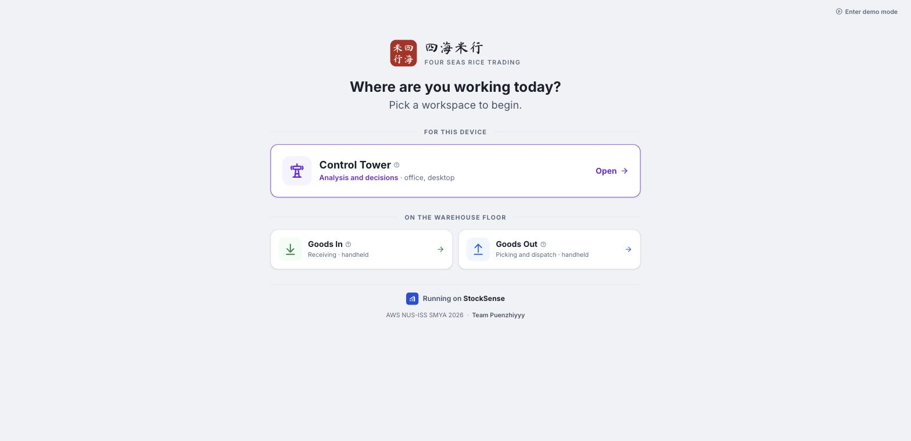

Home asks one question: *where are you working today?* The people who use StockSense do different
jobs in different places, so each has its own workspace instead of sharing one menu:

| Workspace | For | Device |
|---|---|---|
| **Control Tower** | the manager: analysis and decisions | office desktop |
| **Goods In** | the receiver: taking in deliveries | handheld at the dock |
| **Goods Out** | the dispatcher: picking and sending orders | handheld on the floor |

The Control Tower is listed under "For this device" when you open Home on a computer. Every `?` icon
opens a short explanation of what you are looking at.

---

## 2. Receiver: taking in a delivery (Goods In)

**Who:** the warehouse receiver. **Where:** a shared handheld at the loading dock. **Goal:** record
exactly what arrived, against what was ordered, so stock is right and any difference is explained.

The flow is four steps, one decision per screen, with big buttons for use standing up, one-handed, or
wearing gloves.

### Sign in

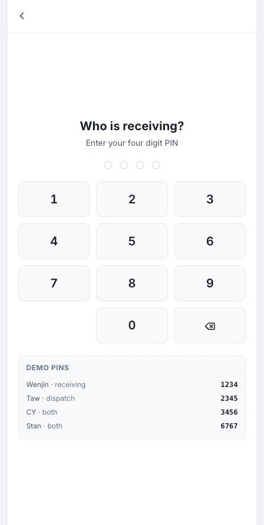

The handheld is shared, so each operator taps their own four digit PIN. Nothing more is needed, and
every stock movement is still recorded against a named person. *(The demo PINs are shown on screen so
anyone trying the app can sign in; a real deployment would not show them.)*

### Step 1: pick the delivery

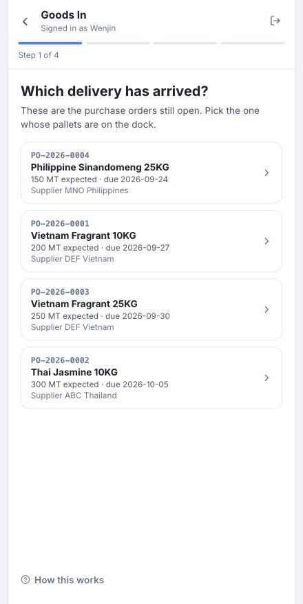

The open purchase orders are listed, with the product, the quantity expected, the due date and the
supplier. The receiver taps the one whose pallets are on the dock. Receiving always happens **against
an order**, never free-form, because that is what lets the system compare what arrived with what was
expected.

### Step 2: confirm the product

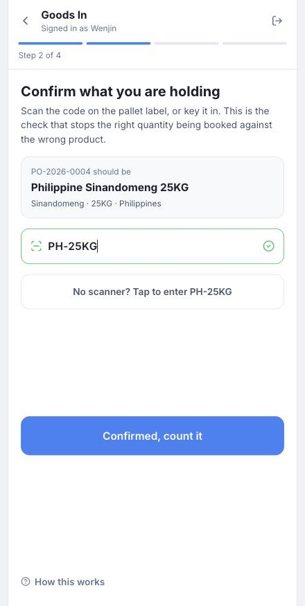

Scan the pallet label or key in the product code. A green tick means it matches the order. This is the
check that stops the right quantity being booked against the wrong product.

### Step 3: count what arrived

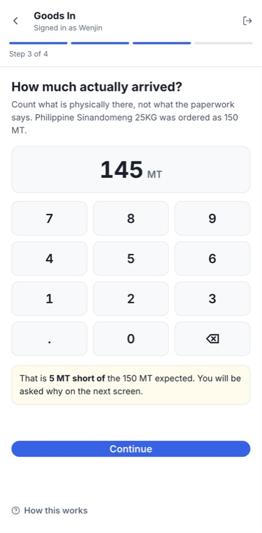

Enter what is physically there, not what the paperwork says. If it differs from the order, the app says
so straight away, here 5 MT short, and warns that a reason will be needed.

### Step 4: check and confirm

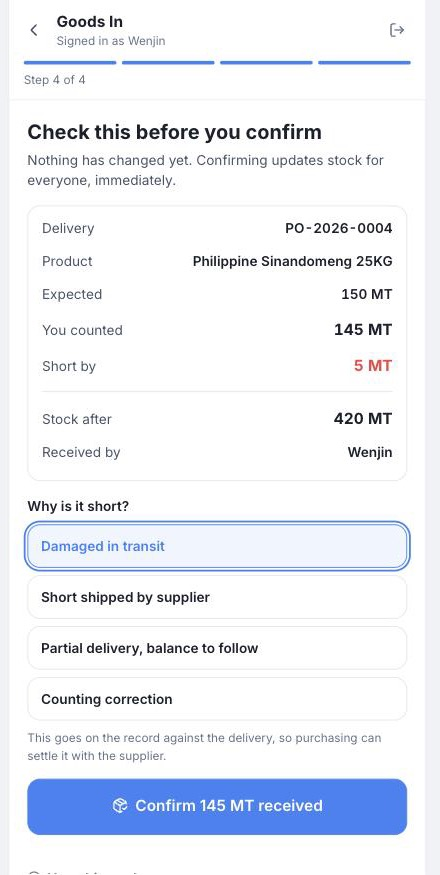

A summary shows the delivery, the product, expected against counted, what stock will be afterwards, and
who is receiving. Nothing has changed yet. Because the count is short, the receiver picks a reason:
damaged in transit, short shipped by the supplier, partial delivery, or a counting correction. Then
**Confirm**.

### Done: the goods received note

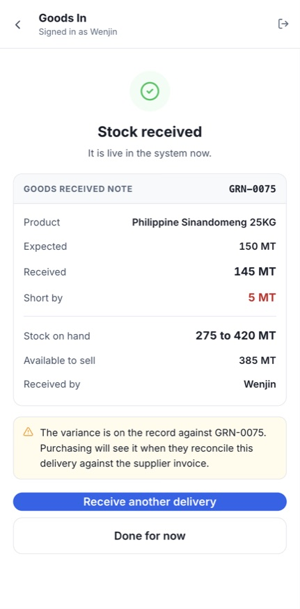

Stock updates for everyone immediately. The receipt gets a document number (a goods received note,
GRN), the purchase order is closed, and the shortfall goes on record so purchasing can settle it with
the supplier. The movement also appears in the manager's History view (section 7).

---

## 3. Dispatcher: sending out an order (Goods Out)

**Who:** the dispatcher. **Where:** handheld, Goods Out. **Goal:** load the right stock onto the right
truck and leave a record of what actually went.

Sign in with a four digit PIN, then four steps, built the same way as Goods In:

1. **Pick the order.** Open customer orders, earliest due first. An order the shelf cannot fully cover
   says so before you walk to it.
2. **Verify the SKU.** Scan the pallet label or key the code; it must match the order.
3. **Count it.** Key in how many MT are leaving. The keypad refuses more than the customer ordered or
   more than is physically on hand.
4. **Confirm.** Review the summary. A short pick asks why, and confirming releases the reserved stock
   and issues a delivery note (DN number) with the operator's name.

_No screenshot yet; capture one with the other two stale guide screenshots._

---

## 4. Manager: the daily review (Dashboard)

**Who:** the inventory manager. **Where:** Control Tower, Dashboard. **Goal:** in under a minute, know
whether customers can be supplied, whether cash is tied up in the wrong stock, and what needs deciding
today.

### Key Metrics

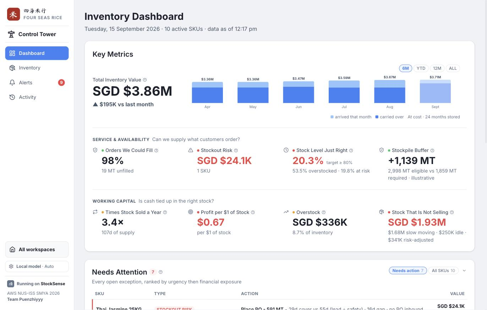

- **Total Inventory Value** with its change on last month, and a bar per month split into **stock
  that arrived that month** (light blue) and **stock carried over** (blue). Buttons switch between the
  last 6 months, year to date, 12 months, and all history. The current month is drawn lighter because
  it is still in progress.
- **Service & availability**, answering *can we supply what customers order?*: orders we could fill,
  money at risk from stockouts, how much stock is at the right level, and the stockpile buffer (the
  regulatory reserve, labelled illustrative).
- **Working capital**, answering *is cash tied up in the right stock?*: times stock sold a year, profit
  per dollar of stock, overstock, and stock that is not selling.

Labels are plain English. Hovering a label's `?` gives the explanation and the industry term (for
example, "Profit per $1 of Stock" is GMROI). The coloured dot beside a label shows whether that measure
is healthy, needs watching, or needs action.

### Needs Attention

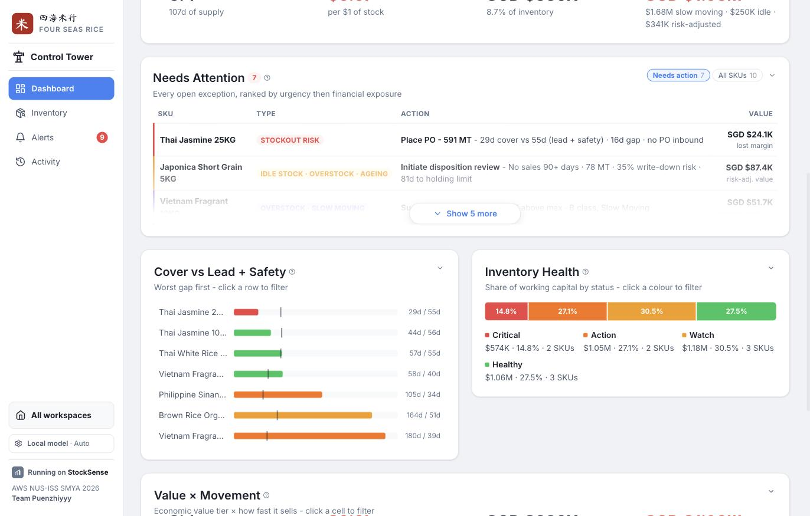

The only section that carries **actions** rather than analysis: every product with an open problem,
ranked by urgency and then by money at stake, with the recommended action and the reasoning in one
line. It shows the most urgent rows first; **Show more** expands the list, and **All SKUs** switches to
every product, including healthy ones.

### Cover vs Lead + Safety, Inventory Health, and Value × Movement

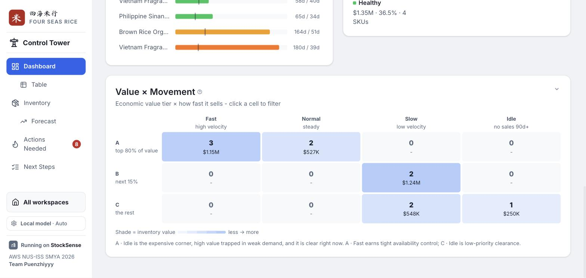

- **Cover vs Lead + Safety:** for each product, how many days current stock will last (the bar),
  against how long a new order takes to arrive plus a safety buffer (the tick). The colour follows the
  product's health, so red is the one to look at first.
- **Inventory Health:** how much of the money in stock is critical, needs action, needs watching, or is
  healthy.
- **Value × Movement:** products grouped by how valuable they are (A, B, C) and how fast they sell (fast,
  normal, slow, idle). High value that is not selling is the expensive corner.

Clicking a bar, a colour or a cell filters Needs Attention to those products.

---

## 5. Manager: acting on alerts (Alerts)

**Who:** the inventory manager. **Where:** Control Tower, Alerts. **Goal:** make a decision on each
problem the system found, with the reasoning in front of you. **Nothing happens without a person
deciding.**

### The alert list

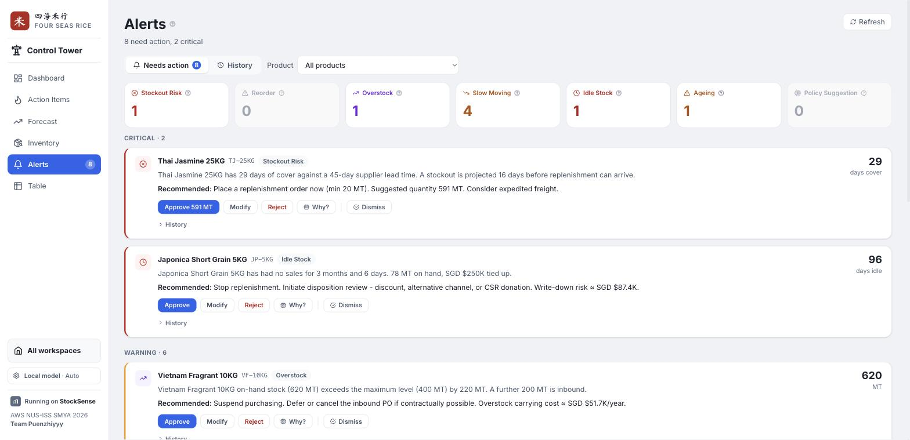

Counts across the top show how many alerts there are of each of the six types:

| Alert | Raised when |
|---|---|
| **Stockout risk** | stock will run out before a new order could arrive |
| **Reorder** | stock, including what is already on order, has fallen to the approved reorder point |
| **Overstock** | stock on hand is above the product's maximum |
| **Slow moving** | the product is selling, but there is far more stock than its demand needs |
| **Idle stock** | no sales at all for 90 days while stock is sitting there |
| **Ageing** | stock has been held long enough to approach its holding limit |

Each card states the measured value, what it was compared against, and a recommended action, then
offers **Approve**, **Modify**, **Reject**, **Why?** and **Dismiss**. When the action is an order, the
Approve button names the quantity.

### Why? The reasoning behind an alert

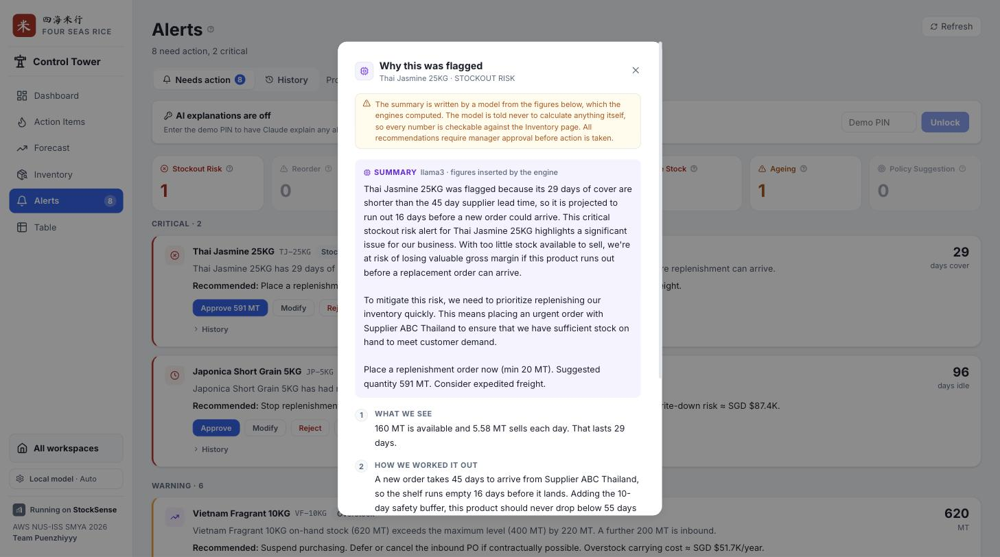

**Why?** opens the reasoning in four plain-English steps: what we see, how we worked it out, what
happens if we do nothing, and what to do. These steps are built from the product's live figures by
fixed rules, so they are always available and cost nothing.

Depending on the explanation setting (section 8), a written summary from a language model can appear
above them, marked **Summary** with the model's name. The model is never allowed to calculate
anything: the figures in its summary are inserted by the system, every answer is checked, and a summary
that fails the checks is never shown.

### Recording a decision

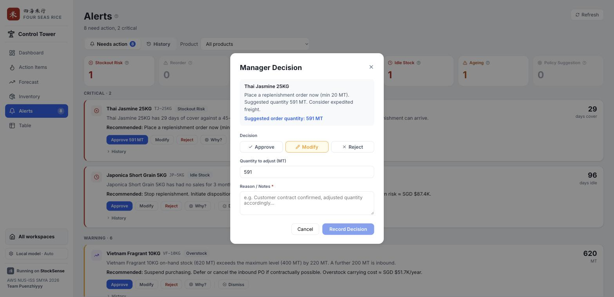

- **Approve** accepts the recommendation as it is.
- **Modify** accepts it with changes. For an order, the quantity can be adjusted.
- **Reject** declines it.

A reason is always required. The decision is stored **beside what the system proposed**, so it is
possible to see later how often, and by how much, managers override the recommendations.
**Dismiss** hides an alert without a decision; it stays hidden even while the problem remains.

---

## 6. Manager: keeping product settings right (Inventory)

**Who:** the inventory manager. **Where:** Control Tower, Inventory. **Goal:** see every product's
position and keep each one's settings (minimum, maximum, reorder point, lead time and so on) correct,
because every alert is judged against them.

### The product list

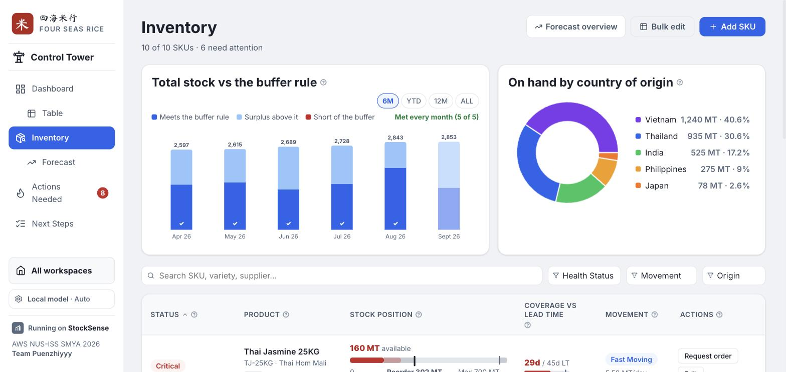

Each row shows the product's health, its **stock position** as a gauge (available stock against the
reorder point and the maximum, with a note such as "142 MT below reorder point"), how long stock will
last against the supplier lead time, and how fast it sells. Search and the filters narrow the list by
health, movement or origin. **Restock** records stock added by hand; **Add SKU** creates a new product.

### A product's overview

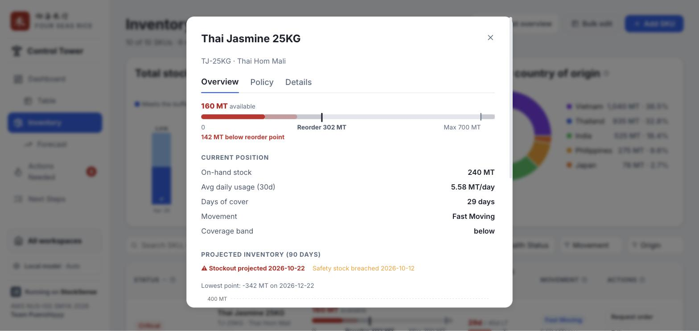

**Edit** opens the product. The **Overview** tab shows the current position and a **90-day
projection**: how stock will fall at the current rate of sales, stepping up when an open purchase order
arrives. It marks the date stock would run out and the date the safety buffer is breached, against the
reorder point and safety stock lines.

### Changing the settings

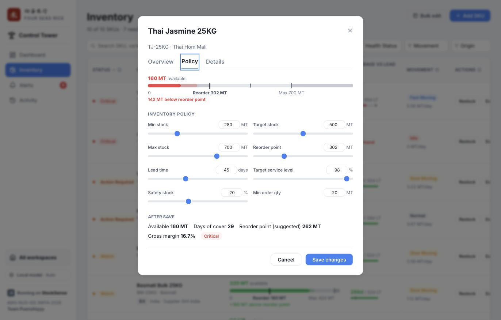

The **Policy** tab holds the settings that alerts are judged against: minimum, target and maximum stock,
the approved reorder point, lead time, target service level, safety stock and minimum order quantity.
Each has a slider and a box. **After save** previews the effect before anything is saved, including the
system's own suggested reorder point for comparison with the approved one. Every saved change is
recorded with its before and after values. The **Details** tab holds the product's identity (variety,
origin, supplier and so on).

### Editing many products at once

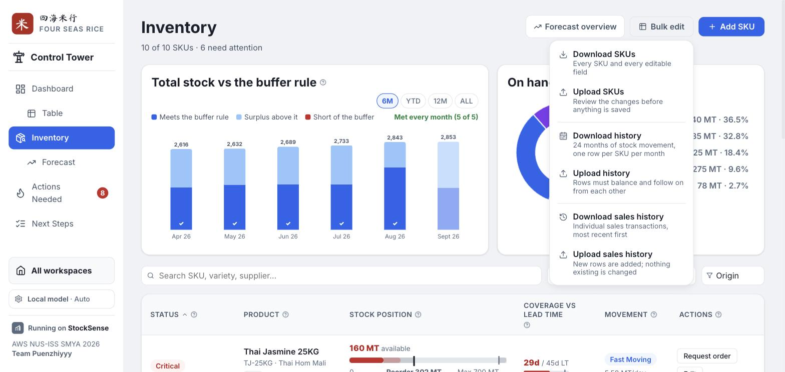

**Bulk edit** downloads every product's editable settings as a spreadsheet file, and uploads it back
after editing. On upload, the changes are shown for review before anything is saved, and a file with
errors saves nothing. The same works for the 24 months of stock history.

---

## 7. Manager: checking what happened (Alerts, History)

**Who:** the manager, or anyone auditing. **Where:** Control Tower, Alerts, History view (the old Activity page, which now redirects here). **Goal:** see everything
the system did and every decision people made, in order, with the evidence.

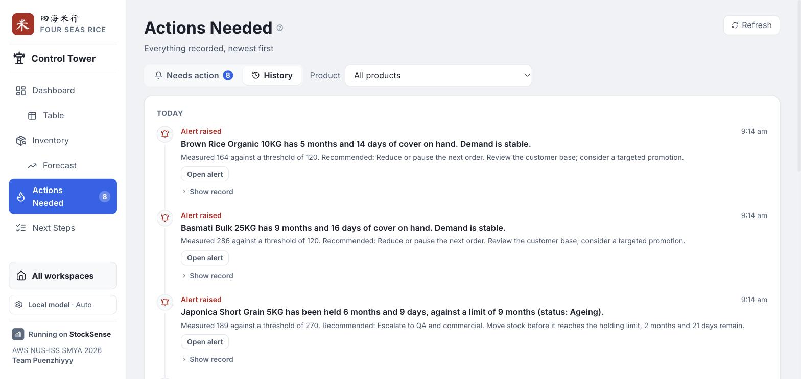

Every event is a plain-English line, newest first: alerts raised, deliveries received (with the
operator and any shortfall), model explanations, manager decisions, dismissed alerts, setting changes,
and paid-model unlocks. The chips along the top filter by type.

**Show record** opens exactly what was stored: what the system saw, and what it did. For a manager
decision, that is the system's proposal next to the manager's choice, the reason, and the difference
between the two quantities:


---

## 8. Anyone: settings

**Where:** the settings button at the bottom of the Control Tower sidebar.

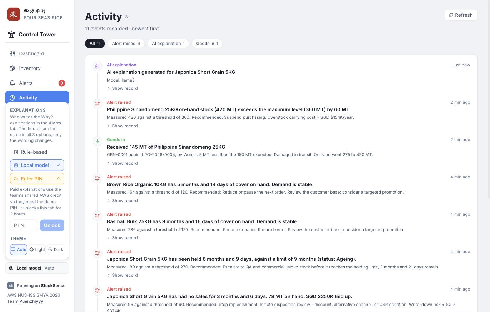

**Explanations** chooses who writes the summary under **Why?**. The figures are the same in all three;
only the wording changes.

| Option | What it is | Cost |
|---|---|---|
| **Rule-based** | no model; the four reasoning steps only | free |
| **Local model** | a model running on the computer itself (available in development) | free |
| **AWS Bedrock** | Claude Sonnet 4.5 through the hackathon's AWS gateway | uses the team's shared AWS credit |

AWS Bedrock asks for the **demo PIN** first, because it spends shared credit. A correct PIN unlocks it
for that browser tab for 2 hours; wrong guesses are limited. Judges receive the PIN with the
submission.

**Theme** switches between Auto (follows the device), Light and Dark.

---

## 9. How the roles connect

The workspaces share one database, so one person's action is immediately another's information:

```
Receiver confirms a delivery (Goods In)
        │   stock on hand rises, the purchase order closes, the movement is recorded
        ▼
The engines recalculate every figure
        │   cover, health, alerts; for example, a big delivery can raise an overstock alert
        ▼
Manager reviews the Dashboard and Alerts
        │   asks Why?, then approves, modifies or rejects, with a reason
        ▼
Everything is in the Alerts tab, History view
            the delivery, the alert, the explanation, the decision and what it overrode
```

For how the app is built and why, see the [README](../../README.md) and the
[write-up](../Submission/WRITEUP.md). For every document in the repository, see the
[directory](../DIRECTORY.md).
