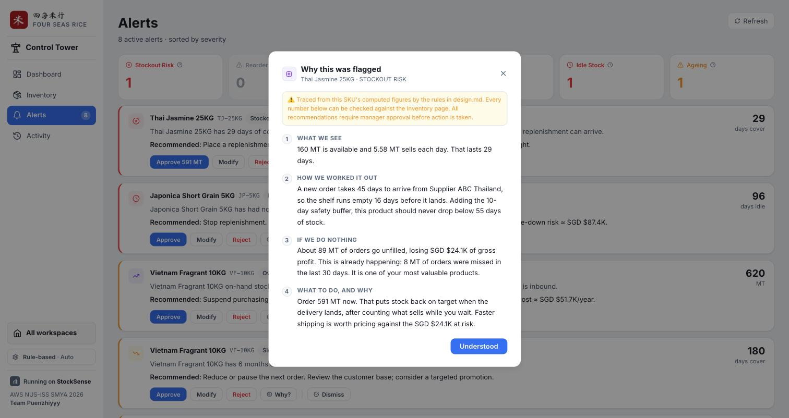
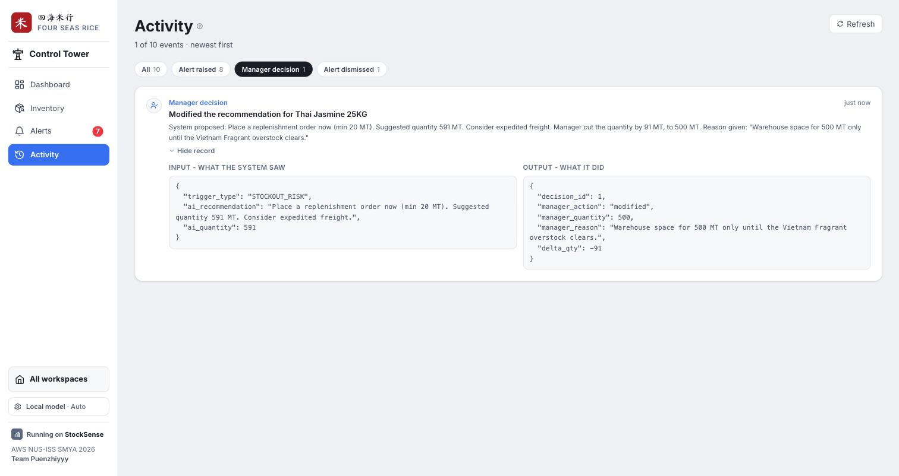

# StockSense

**Agentic inventory management for a rice importer/distributor**

AWS NUS-ISS SMYA 2026 Hackathon

---

> **Note for Stan, delete before export.** This is the PDF write-up draft, refreshed on 15 Sep for
> everything built since 13 Sep: the live model layer and its safeguards, the demo PIN, spend tracking,
> the warehouse floor screens and the plain-English explanations. Three things to fill in, **in the
> exported PDF only**:
>
> 1. **Live URL** in section 8, once the service is up.
> 2. **The demo PIN** in section 8. Type it into the PDF, never into this file: the repository is
>    public, and a PIN committed here is a PIN anyone can find.
> 3. **The development spend figure** in section 3, after the final paid check near the deadline
>    (`node scripts/spend.js` and `docs/(Stan) 1 Reference/(Stan) MODEL SPEND.md`).
>
> Export with any markdown to PDF tool (Typora, Pandoc, or VS Code's "Markdown PDF"),
> from this folder (`docs/Submission/`) so the image paths resolve.

---

## 1. The problem

A rice distributor runs on two objectives that pull against each other: never miss a customer order, and
never tie up cash in stock nobody is buying. Spreadsheets force a manager to hold both in their head at
once, for every SKU, every week.

The failure mode is not dramatic. It is a slow drift in which the fast movers quietly run short while
the slow movers quietly accumulate, and nobody notices either until a customer is turned away or a
quarter closes with too much working capital sitting in a warehouse. Neither problem announces itself,
because the spreadsheet shows stock levels, not the two questions that matter:

- Can we supply what customers order?
- Is cash tied up in the right stock?

StockSense does the arithmetic continuously, surfaces only the SKUs that need a decision today, and
leaves the decision itself to the human. Those two questions are literally the headings of the two KPI
groups on the dashboard.

---

## 2. Architecture

### The reasoning loop

```
   sales, purchase orders, stock positions (SQLite)
                    │
                    ▼
   ┌────────────────────────────────────┐
   │  9 deterministic analytics engines │   velocity, position, safety stock,
   │  (backend/src/engines/)            │   classification, segmentation, health,
   └────────────────────────────────────┘   financials, alerts, projection
                    │
                    ▼
        typed alerts with thresholds        "Japonica 5KG: no sales in 96 days,
        and a recommended action             SGD 250K tied up. Stop replenishment."
                    │
                    ▼
   ┌────────────────────────────────────┐
   │  MANAGER                           │   optionally asks the LLM "why?"
   │  approve / modify / reject         │   nothing is ever auto-executed
   └────────────────────────────────────┘
                    │
                    ▼
         decision recorded, stock and
         policy updated, everything
         written to the audit log ──────────►  /activity
```

Every arrow in that diagram writes a row to `audit_log`.

### Three workspaces, one database

Stock arrives, stock leaves, and somebody decides what to do about what is left. Those are three
different jobs done by different people on different devices, so the first screen offers three ways in
rather than one navigation:

- **Goods In**, on a handheld at the dock. Receive against a purchase order in four steps (pick the
  delivery, verify the SKU, count it, confirm), so the system records "195 MT arrived against 200
  expected, five short, damaged in transit" rather than "someone typed a number".
- **Goods Out**, on the same handheld: picking against an open sales order works in the API, and its
  handheld screens are the next thing to build (shown as "Coming soon" on Home).
- **The Control Tower**, on a desktop, for the manager: Dashboard, Inventory, Alerts and Activity.

Floor operators sign in with a four digit PIN, because a shared rugged terminal on a charging cradle is
used by whoever picks it up, and every movement still has to be attributed to a named person. Every
receipt and issue changes the same stock figures the Control Tower analyses, and lands in the same audit
trail.

### Stack

React 18 and Vite on the front end, Express on the back, SQLite via better-sqlite3 for storage, Recharts
for charts, and plain CSS custom properties for styling. Explanations come from Claude Sonnet 4.5 on
Amazon Bedrock through the hackathon gateway, with a local llama3 for free development and a rule-based
explanation that needs no model at all (section 3).

SQLite was chosen over PostgreSQL deliberately: one file, no server to provision, and the entire demo
state is reproducible from a fixed random seed with a single command. For a hackathon handoff that
matters more than horizontal scalability. The same property is what makes the deployment resilient, as
section 8 explains.

There is no CSS framework. The type scale is deliberately sized up for older users and the contrast
ratios are checked against WCAG AA rather than inherited from a framework's defaults.

### Layout

```
backend/src/
  db/init.js       schema: skus, inventory_positions, sales_transactions,
                   purchase_orders, sales_orders, goods_movements, operators,
                   inventory_history, alerts_log, decisions, audit_log
  db/seed.js       deterministic generator: 10 rice SKUs, 961 sales transactions,
                   24 months of balanced stock history
  db/audit.js      audit-log write path
  engines/         the nine engines below, plus index.js as orchestrator
  llm/             the explanation layer: placeholders, checks, tiers, PIN gate
  routes/          the Control Tower API and the warehouse floor API

frontend/src/
  pages/           Home, Dashboard, Inventory, Alerts, Activity
  warehouse/       Goods In and operator sign-in, for the handheld
  components/      StockPositionBar (bullet graph), StatCard, HoverHint, ...
  api/             fetch client
  index.css        the design system, light and dark
```

### The nine engines

Each runs in dependency order and contributes fields to a single enriched SKU record.

| Engine | Responsibility |
|---|---|
| `velocity` | rolling 30/60/90/180-day consumption, the 30-day average demand rate, demand variability, trend |
| `position` | available quantity, expected incoming, inventory position |
| `safetystock` | statistical safety stock from a target service level (King's formula) |
| `classification` | Fast / Normal / Slow / Idle, by throughput |
| `segmentation` | ABC by annual consumption value, Pareto |
| `health` | RED / ORANGE / YELLOW / GREEN, evaluated in order, first match wins |
| `financials` | turnover, days inventory outstanding, GMROI, fill rate, exposure values |
| `alerts` | six typed alerts, deduplicated, each with a recommended action |
| `projection` | 90-day projected stock curve including inbound purchase orders |

Representative formulas, all from `design.md`:

```
available_qty       = on_hand_qty - reserved_qty - quality_hold_qty
inventory_position  = available_qty + expected_incoming_qty
days_of_cover       = available_qty / avg_daily_usage_30d (Not Applicable when demand is zero)
reorder_point_sugg. = lead_time_demand_mt + safety_stock_mt
annual_cons._value  = avg_daily_usage_30d * 365 * unit_cost_sgd
projected_avail(d)  = available_qty - (avg_daily_usage_30d * d)
                      + sum of open-PO quantity landing on or before day d
```

---

## 3. Why deterministic first

Most "AI inventory" tools put a language model in the critical path and let it do the arithmetic.
StockSense does not. Around ninety percent of the system is deterministic, and the language model is
invoked only when a manager explicitly asks "why?" about a specific flagged SKU.

This is a design decision with three separate justifications, not a limitation:

**Cost.** The target user is an SME with a real token budget. A system that calls a model once per SKU
per refresh is unaffordable at the scale these businesses operate at, and the cost scales with catalogue
size, which is exactly the wrong direction.

**Trust.** Every number on screen can be traced to a formula in `design.md` rather than to a generation.
A distributor deciding whether to commit working capital to a purchase order needs to be able to ask
where a figure came from and get the same answer twice.

**Correctness.** Inventory arithmetic is not a domain where approximation is acceptable. Available stock
either accounts for reserved quantity or it does not. A deterministic engine gets this right every time
by construction.

The language model earns its place precisely where deterministic logic is weak: turning a correct but
terse recommendation into an explanation a human can evaluate and argue with.

### The explanation a manager always gets

Asking "why?" on an alert first returns the chain that produced it, not a restatement of the conclusion.
It is rule-based: built from the SKU's live figures by documented rules, in four short plain-English
steps. It needs no model, costs nothing, and gives the same answer every time for the same figures.



*Four steps: what we see, how we worked it out, what happens if we do nothing, and what to do, and why.
Every figure is checkable against the Inventory page.*

### The model narrates and never computes

A model summary is then requested in the background. The hard problem with a language model near money
is not that it is sometimes wrong; it is that it is wrong fluently, with real-looking numbers. So the
model is never trusted with a number, and the protection is built in three layers.

**1. It cannot write a figure.** The model is not given the figures. It receives each one as a named
placeholder, `{available_stock}` or `{lead_time}`, and writes prose around them; the system substitutes
the engine's own values afterwards. A digit in the model's answer is rejected outright (the pack size
in a product name, "5KG", is the one exception), and so is any placeholder that does not exist. Stating
a figure the engines did not produce is not merely detectable in this mode, it is unwritable.

**2. It cannot mix up why the alert fired.** Real figures in a false relationship are the next failure,
and we saw it in testing: *"The inventory position has reached 250 MT"*, where 250 MT was the reorder
point and the position was 230 MT. Every number real, the sentence wrong. So the system writes the
opening sentence itself, stating the rule that fired with its figures, and withholds those figures from
the model entirely. The model cannot re-pair numbers it is never given. The approved action is
guaranteed the same way: if the model's answer does not state it, the system appends it.

**3. Everything else is checked before it is shown.** Every figure in the final text is traced back to
the engine's data for that alert. Semantic checks then catch the rest: arithmetic that does not hold
("exceeds by"), a figure attached to the wrong named quantity, an order quantity other than the
recommended one, ordering advised on an overstock alert, or a claim that an action was already taken
when every action waits for a manager. A rejected answer is retried with the reasons it failed, twice
with placeholders, then once more with the model writing figures itself, each checked against the
engine's data. If all three fail, the manager sees the rule-based explanation instead. **A wrong
figure is never shown**, which is why the model can be switched on at all.

### Measured, not assumed

`backend/scripts/bench-models.js` runs the production pipeline with only the model call swapped, across
every live alert type, and records why each attempt was rejected. Reading those reasons, rather than
concluding "the model is weak", is what fixed it: most retries were the checks rejecting harmless text,
such as the "5KG" in a product name.

| Measured on llama3, every live alert type | Before the safeguards | After (32 explanations) |
|---|---:|---:|
| Accepted on the first attempt | 0% | 94 to 97% |
| Model calls per explanation (this is the cost) | 2.59 | 1.03 to 1.06 |
| Contradictions shown to the manager | 3 | 0 |

The guarantees in layers 1 and 2 hold for any model, because the model never handles those figures.
Wording is what varies between models, so the paid model gets a final check of its own before submission.

### Three tiers, and a PIN on the one that costs money

| Tier | Where it runs | Cost |
|---|---|---|
| Rule-based | everywhere, always | free |
| Local model | llama3 on a developer's machine | free |
| AWS Bedrock | Claude Sonnet 4.5 through the hackathon gateway | about USD 0.0055 per explanation |

Each visitor picks a tier for themselves; one visitor's choice never changes another's. The paid tier
needs a demo PIN, checked on the server. A repeated question on an unchanged alert is served from cache
for free, and a daily cap of 200 paid calls bounds the worst possible day at about USD 1.20. Every paid
call, including failed attempts, is recorded with its tokens, so spend is a query rather than a guess.
Paid model spend across all of development: **USD [fill in] over [n] calls.**


---

## 4. Domain modelling

These are the distinctions the engines enforce, drawn from a rice-industry glossary maintained in
`.kiro/specs/mvp1-inventory-visibility/reference/`. They are the difference between a dashboard that
looks right and one that is right, and most of them were corrections applied after checking the
implementation against real domain documentation.

| Rule | Why it matters |
|---|---|
| On Hand is not Available | Available = On Hand minus Reserved minus Quality Hold. Promising reserved stock to a second customer is how you miss an order while the warehouse looks full. |
| Purchase orders are never added to stock | Inbound POs are Expected Incoming, a separate figure, until a receipt posts. Adding them hides a stockout that has not happened yet. |
| Two reorder points, shown side by side | `reorder_point_suggested` is what the maths says. `reorder_point_policy` is what the business approved, and what alerts actually fire on. Merging them hides every disagreement between the model and the operator. |
| Days of Cover is "Not Applicable" at zero demand | Never infinity, never blank. An idle SKU is a distinct problem from a well-covered one, and rendering it as a blank cell loses that. |
| Movement class and ABC class are separate axes | A SKU can move fast and matter little. Conflating velocity with economic value is the classic ABC mistake. |
| Compliance Position is labelled illustrative | The Singapore rice stockpile scheme is a real regulatory requirement. Our implementation substitutes demand throughput for genuine import-receipt history, so it is labelled as provisional everywhere it appears rather than presented as authoritative. |

One of these deserves expanding, because it is the clearest example of the difference between building a
dashboard and modelling a domain. The **two reorder points** are not redundancy. The system calculates
what the reorder point ought to be from current lead time and demand variability. The business
separately approves an operating value it actually runs to. When those two numbers disagree, that
disagreement is information: it means either the policy is stale or the demand pattern has shifted.
Averaging them into one figure, which is the obvious simplification, destroys exactly the signal worth
having.

---

## 5. Autonomy and human in the loop

**Nothing is ever auto-executed.** Every output of the alert engine is a recommendation carrying a
quantity and a rationale, and every recommendation terminates at a human decision: approve, modify, or
reject, with a free-text reason.

That decision is persisted in the `decisions` table alongside what the system had proposed. Storing both
sides is the point. It makes the following queryable rather than anecdotal:

- how often managers override the system, and in which direction
- whether overrides cluster on particular SKUs, suppliers, or alert types
- whether the recommended quantities are systematically too high or too low

That last one matters for the roadmap: the decision table is the training data for a Phase 2 model that
learns the business's actual risk appetite, rather than assuming the textbook one.

The interaction is deliberately shaped so the human is deciding, not rubber-stamping. The alert states
the measured value and the threshold it breached, so a manager can disagree with the reasoning rather
than only with the conclusion. Modify is a first-class action rather than an escape hatch, because in
practice the right answer is frequently "yes, but not that much."


*Every recommendation terminates at a human decision, and the primary button states what approving will
record. Severity is carried by the left stripe, type by the icon and chip, so the card encodes each fact
once.*

---

## 6. Observability

`audit_log` records eleven event types, each storing both the input the system saw and the output it
produced:

`ALERT_TRIGGERED` · `ALERT_ACKNOWLEDGED` · `DECISION_RECORDED` · `RESTOCK` · `SKU_CREATED` ·
`SKU_UPDATED` · `GOODS_RECEIVED` · `GOODS_ISSUED` · `LLM_CALL` · `LLM_UNLOCKED` · `LLM_UNLOCK_LOCKED_OUT`

Four details make this an audit trail rather than a log file:

**`SKU_UPDATED` stores a field-level before and after diff.** "A row changed" is not observability.
"Lead time went 45 to 50 days" is. A save that changes nothing records nothing, so the trail does not
fill with no-op rows.

**`ALERT_TRIGGERED` fires on first materialisation only.** It is written inside the deduplication guard,
so it means "this condition first became true" and not "somebody loaded the Alerts page". Without that
distinction the event is noise.

**`DECISION_RECORDED` stores the proposal next to the action,** plus the delta between the two
quantities, which is what makes override rate a query rather than a research project.

**`LLM_CALL` stores what the model cost and what it got wrong,** including attempts that failed the
checks: the tier, the model, tokens in and out, the number of calls, and the issues found. Model spend
is read from this table, not estimated, and a PIN lockout on the paid tier is recorded as its own event.

Logging is best-effort by design: a failed audit insert is swallowed and reported to the server log
only. An audit trail that can fail the restock it is recording is worse than no audit trail.

The Activity page renders the whole trail as a chronological list of plain-English sentences, with the
exact stored payload one click away. Raw JSON is not observability either; it is a prerequisite for it.



*A manager cutting a suggested 591 MT stockout order to 500 MT, as the audit trail stored it: what the
system proposed, what the manager did instead, the reason, and the delta between the two quantities.*

---

## 7. What we deliberately did not build

Stating scope decisions with reasons is more honest than presenting a partial system as complete.

**The model does not decide anything.** It explains a recommendation the engines already made. It
cannot change a quantity, raise or clear an alert, or trigger an action, and its answer is checked
before anyone reads it. Giving it more reach is a governance question, not a prompt, and it waits until
the decisions table shows how far managers trust the engines themselves.

**Scoped out of MVP 1 on purpose:**

| Not built | Reason |
|---|---|
| Immutable movement ledger | Balances are a mutable snapshot rather than rebuildable from history. A real ledger is a Phase 2 data-model change, not a feature. |
| Lot and batch genealogy | Ageing is tracked at SKU level. Batch-level tracking changes the grain of every table. |
| Blocked / damaged / rejected stock statuses | The quality-hold field covers the common case; the full taxonomy needs warehouse process integration. |
| Backtested demand forecasting | MVP 1 uses observed velocity, not a forecast. Presenting an unvalidated forecast as a number would be worse than not having one. |
| Agent execution governance | Nothing executes autonomously, so the governance layer that would constrain it is not yet needed. |

The full list with rationale is in the spec's "Explicitly Deferred" section.

---

## 8. Deployment

The application deploys as a single service: the Express process serves both the API and the built
front end from one origin. It runs as a container on AWS Lightsail. GitHub Actions builds the image for
linux/amd64 on every push, starts it with production settings, runs smoke tests against the live
container, scans it for anything shaped like a credential, and only then publishes it; Lightsail pulls
that exact tested image. The gateway key and the demo PIN exist only in Lightsail's environment
settings, never in the repository or the image.

On a public URL the paid model tier is gated per visitor: a demo PIN, checked on the server, unlocks a
signed two hour pass for that browser tab, with lockouts against guessing and a daily call cap covering
every metered backend. Anyone can use the rule-based and deterministic explanations without it.

Because the seed is deterministic, persistence is optional rather than load-bearing. The instance seeds
itself on first boot when the SKU table is empty, so a restarted container returns with exactly the same
10 SKUs, 961 sales transactions, 4 open purchase orders and 13 open sales orders. Attaching a persistent disk preserves
visitor-created state as well; running without one is a supported mode rather than a degraded one.

**Live URL:** `[fill in once deployed]`

**Demo PIN for judges:** `[fill in the PDF only]`. Open Settings in the sidebar, choose AWS Bedrock, and
enter it to see Claude's explanation beside the rule-based one. Warehouse floor PINs are shown on the
sign-in screen.

---

## 9. Roadmap

**MVP 2** adds demand forecasting with backtesting, lead-time intelligence derived from actual supplier
performance rather than the configured value, and a fuller projected-stock curve.

**Phase 2** uses the accumulated `decisions` table as training data, so recommendations reflect the
business's demonstrated risk appetite rather than a textbook service level.

**Phase 3** covers the deferred data-model work: the immutable movement ledger and batch genealogy,
which together make the system reconstructible from history rather than dependent on a current snapshot.

---

## Appendix: running it locally

Requires Node 18 or later.

```bash
npm run install:all
cd backend && npm run seed
npm run dev:backend      # http://localhost:4000
npm run dev:frontend     # http://localhost:5173
```

`npm run seed` is safe to rerun at any time and resets the demo to a known state.

**Repository:** https://github.com/dunstancsr-web/puenzhiyyy
